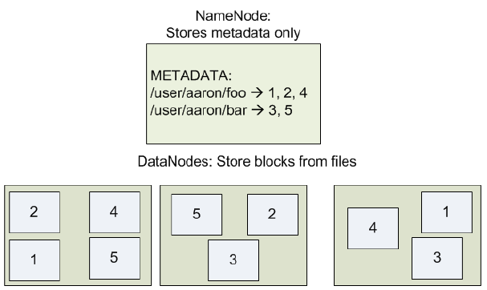
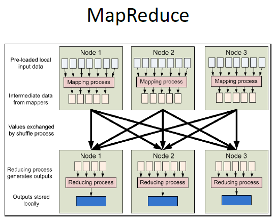

目录
* [Introduction](#Week1-Introduction)
* []

## Week1. Introduction

主要的内容：Major topics

#### 1. Storage systems
* Hard disk 
    read, write, and erase
* SSD (solid state drive)
 
 

#### 2. File systems & file formats
* Standalone(单机)
    * Data structures (data blocks, Metadata blocks (inodes), Bitmap blocks)
    * Access paths (read, write)
* Network (client-server 联机)
    * client-server architecture (Sun's network file system)
    * Key concept: stateless fiel handle 用其操作文件
* **Distributed** (eg.Hadoop 多数据服务器)
    * Hadoop **HDFS**  
        data are distributed among data nodes
        
    * Replication  
        Automatic creation of replica (typically 2 or 3 copies/replica of data)
    * Fault-tolerant 容错 
        Automatic recovery from node failure
* File formats
    * JSON
    * HTML
    * XML
        * usages:  
            Software configurations file (HDFS) 
            Android app development (Layout resource files) 
            Java archive (.jar file)
    * Data Model for XPath

 
 

#### 3. Database management systems

* Relational DBMS (RDMBS)
    * Data models (ER, Relational)
    * Schema (Normal forms: BCNF (Boyco-Codd normal form) 严格约束)
    * **Query languages**
        * Relationsl algebra
        * **SQL**, constraints, views
    * Data organizaiton
        * Records and blocks
        * Index structure: B+-tree
    * Query execution algorithms
        * External sorting
        * One-pass algorithms
        * Nested-loop join
        * Multiple-pass algorithms
    * features:
        * Rigid schema
        * Strong consistency is the key design goal
            - never read old data
            - Suitable for mission-critical applications, e.g., banking
            * / low availability 
            * / hard to scale out (不能水平分布，像HDFS一样重组)
    * Example ：
        * **MySQL**
        * Amazon RDS (relational database service)
            * DBMS in the cloud
            * Database as a service
        * Data warehouse on RDBMS
            * **OLAP** 联机分析处理 (online analytical processing) 

 
 

#### 4. Big data solution stack  
for big data management & analytics
* Cloud data storage
    * Amazon S3 (simple storage service) 
        ideal for storing large binary files, eg., audio, video, image
        * simple RESTful web service
    * 特点: Eventual consistency for high availability 

* NoSQL
    * Amazon DynamoDB,
    * Cassandra
    * MongoDB
    * Google Firebase
* **Apache Hadoop & MapReduce**
* **Apache Spark**

<table style="font-size:90%">
    <tr>
        <td>Name</td> 
        <td>Features</td>
        <td>Application</td>
        <td>Detail</td>
        <td colspan="2">Key Technology</td>
   </tr>
    <tr>
        <td >Cloud data storage</td>    
        <td >high availability</td>
        <td >Amazon S3</td>
        <td >1. ideal for storing large binary files  2. Simple RESTful (representiational, state transfer) web service</td>
        <td colspan="2"> </td>
    </tr>
    <tr>
        <td rowspan="3">NoSQL (Structural Query Language)</td>
        <td rowspan="3">1.Flexible schemas  2.High availability  3. / weaker consistency model</td>
        <td>Amazon DynamoDB</td>
        <td>每一行就是一个item，用key-value对表示</td>
        <td rowspan="2">consistent hashing (scaling out时不会带出多余的数据）</td>
        <td rowspan="3">1. 对于频繁更新的APP可以有效的写入: Append-only, No overwrites, Avoid random seek, But compaction needed later 2.compaction合并 </td>
    </tr>
    <tr>
        <td>Apache Cassandra</td>
        <td>wide column store Google's Bigtable clone</td>
    </tr>
    <tr>
        <td>MangoDB, Firbase, etc.</td>
        <td>Manage JSON document</td>
        <td>None</td>
    </tr>
    <tr>
        <td>Hadoop & MapReduce</td>
        <td colspan="2">1. 无循环数据流(data loaded from stable storage HDFS, processed through a sequence of steps, results written to disk) 2. 批量处理，不需要互相许可</td>
        <td>用函数表达。 有map（映射成为一个list）和reduce（list到value）两个函数 在python中需要借助lambda函数实现</td>
        <td colspan = '2'>具体流程见下图 问题： 1.适合需要重复使用数据的算法，如kmeans，Pagerank，回归 2.适合需要联机分析OLAP的数据</td>
    </tr>
    <tr>
        <td>Spark (in-memory MapReduce)</td>
        <td colspan="2">1.通过弹性分布式数据集工作（可以重复使用，容错）  2. 迭代运算比Hadoop快10倍 3. Interactively explore 39GB with sub-second response time</td>
        <td>RDD(resilient distributed dataset),Transformations, Actions</td>
        <td colspan = '2'>Spark快是用了存储器内运算技术，能在数据尚未写入磁盘的时候，在存储器里面运算，但是Hadoop需要把每次shuffle之后的结果都写入磁盘。此外，Spark的task操作是线程的，而Hadoop是进程</td>
    </tr>
</table>

 
 

* 5. Data warehousing (if time permits)

 
 
#### 文件系统 vs. 数据库系统

文件系统是操作系统用于明确存储设备（常见的是磁盘，也有基于NAND Flash的固态硬盘）或分区上的文件的方法和数据结构；即在存储设备上组织文件的方法。操作系统中负责管理和存储文件信息的软件机构称为文件管理系统，简称文件系统。

文件系统由三部分组成：文件系统的接口，对对象操纵和管理的软件集合，对象及属性。从系统角度来看，文件系统是对文件存储设备的空间进行组织和分配，负责文件存储并对存入的文件进行保护和检索的系统。具体地说，它负责为用户建立文件，存入、读出、修改、转储文件，控制文件的存取，当用户不再使用时撤销文件等。

数据库系统DBS（Data Base System，简称DBS）通常由软件、数据库和数据管理员组成。其软件主要包括操作系统、各种宿主语言、实用程序以及数据库管理系统。

数据库由数据库管理系统统一管理，数据的插入、修改和检索均要通过数据库管理系统进行。数据管理员负责创建、监控和维护整个数据库，使数据能被任何有权使用的人有效使用。数据库管理员一般是由业务水平较高、资历较深的人员担任。