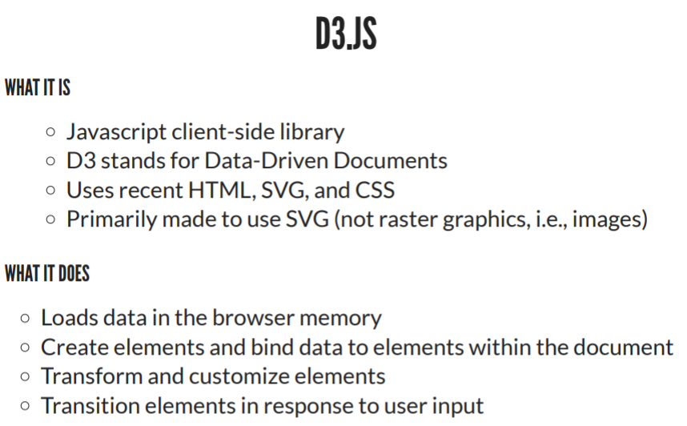

* 目录
    * [Week1. Introduction to Data visulization](#Week1-Introduction_to_data_visulization)
    * [Week2. Survey of visualization techniques](#Week2-Survey-of-visualization-techniques)
    * [Week3. Design space of visualizations, graphing in teh browser, introduction to D3 and Vega](#week3-Design-space-of-visualizations-graphing-in-the-browser-introduction-to-D3-and-Vega)
    * [Week4. Designing infographics and dashboards, D3 data join basics and loading data](#Week4-Designing-infographics-and-dashboards-D3-data-join-basics-and-loading-data)
    * [Week5. The eye and the visual brain, D3 scales and exes](#Week5-The-eye-and-the-visual-brain-D3-scales-and-exes)
    * Week6. Project proposal presentation
    * [Week7. pre-attentive features, interactive visualizations with d3](#Week7-pre-attentive-features-interactive-visualizations-with-d3)
* [quiz](#quiz)
    * [quiz4](#quiz4)


# Week1. Introduction_to_data_visulization

### 1.1 Data visualization


* compare data,information,knowledge and widsom


    data: 关键字，名词
    inforamtion：客观真理，事实
    knowledge：带有个人态度的内容，包含比较，等
    widsom： 带条件的事实，in...condition 等

&nbsp;

* data visualization in data science

[where is data visualization useful in data science](https://www.menti.com/cwi1vhv27g)


&nbsp;

* units of data & inforamtion 


&nbsp;

* Concepts:
    * **Data visualization** refers to the techniques used to communicate data or information by encoding it as visualobjcts (e.g. points, lines or bars) contained in graphics. The goal is to communicate information clearly and efficiently to users. It is one of the steps in data analysis or data science.
    * **information visualization** is the study of (interactive) visual representations of abstract data to reinforce human cognition.

You are aware of just 0.7% of what you experience.

&nbsp;

* Universal Capabilities
    * Typically in less than 1/10s
    * Does not require eye movements
    * Does not require focused attention
    * Color and boundary can be detected preattentively
        * Some color combinations are differentiated by everyone (blue/yellow)
        * Some symbols are understood across cultures(emoj)

----
&nbsp;

### 1.2 Examples and uses


&nbsp;

* Design Considerations


&nbsp;

### 1.3 Tools and software




&nbsp;
&nbsp;
&nbsp;

# Week2. Survey of visualization techniques
&nbsp;

### 2.1 Data
Data is plural (from the latin 'what is given')
Datum is a given piece of data
<br>

* Data types
    * Categorical
        * Nominal:  no natural ordering<br>
             eg., gender, ethnicity, nationality
        * Ordinal:  logical ordering but difference not meaningful 差异没有意义<br>
             eg., levels of happiness, levels of difficulty
    * ( Qualified categorical data 另一种分类方法
        * Binomial      eg., right/left,true/false
        * Dichotomous对立的 eg., hot/cold
            * Vs. non-dichotomous   eg,. Likert Chart)
    * Numerical
        * Ratio:  ordered, differences & doubling meaningful, 0 fixed<br>
             eg., temperature in Kelvin (40=2×20), length, height
        * Intervel:  ordered, differences meaningful, doubling not meaningful, 0 arbitrary<br>
             eg., temperature in Celsius (40≠2×20)/Fahrenheit, dates, locations

* Data Models
    * Conceptual<br>
         Semantic description of data entities and their relations
    * Logical<br>
         Implementation independent data design representation<br>
         eg., entity-relationship diagram
    * Physical<br>
         Implementation dependent details by which data is actually stored (with data types)

* Visualization Reference Model
    
<br>
<br>

### 2.2 Visualization Techniques
1. **Charts**
    * Dots
        * <u>Scatterplot</u>散点图  (2+ variables in Cartesian coordinate)
        * <u>Bubble chart</u>  点图 (3 continuous variables: bubble center (2) and radius (1))
    * Bars
        * <u>Bar chart</u>  (Bar length proportional to continuous variable)
        * <u>Lollipop chart</u> 注重具体高度 (Line length proportional to continuous variable and data point)
    * Bar layouts
        * <u>Coxcomb chart</u>鸡冠花图  (Same angle, radius encodes value, colors different categories. Stacked bar chart with radial layout.)
        * <u>Marimekko chart</u>  (Bar chart where the width encodes relative size. Also called Mekko chart.)
        * <u>Waterfall chart</u>  (Cumulative effects of sequence of positive and negative variations)
        
    * Pies
        * <u>Pie chart</u>  (Exploded pie chart. Pie charts, are a stacked bar charts in polar coordinates. Angle encodes proportion.)
        * <u>Donut chart</u>  (Pie Chart with centre area cut out. Angle encodes proportion.)
        
    * Lines
        * <u>line chart</u> (Trends on continuous variables, e.g., time-series)
        * <u>Sparkline</u>心电图  (Trends on small window size [Tufte 2004])
    * Line layouts
        * <u>Slopegraph</u>  (Shows data values, trends [Tufte 1983])
        * <u>Parallel coordinates</u>  (Multivariate data.)
        * <u>Radar chart</u>  (Multivariate data. Also named web, spider, star, cobweb, polar, or Kiviat.)
        
    * Area
        * <u>Area chart</u>  (Show cumulative or proportions and trends)
        * <u>Steramgraph</u>  (Type of stacked area graph which is displaced around a central axis, resulting in a flowing, organic shape)
        


2. **Graphs and Trees**
    * Hierarchies
        * <u>Dendrogram</u>系统树图  (From Greek dendro tree and gramma drawing.)
        * <u>Reingold-tilford tree</u>  (Hierarchical data as linked tree)
        

        * <u>treemap</u>  (Hierarchical data as nested rectangles. Area proportional to value.)
        * <u>sunburst</u>和鸡冠图很像  (Hierarchical data as rings. Center is root node. Angles are equal or proportional to value.)
    * Flowcharts
        * <u>Alluvial diagram</u> (Shows relations between multivariate data. Named after alluvial fans formed by soil deposited by streaming water.)
        * <u>Sankey Diagram</u>  (Magnitude of flow between nodes in a network)
        
    * <u>Networks network graph</u>  (Relationships (lines) between entities (nodes))
    * Matrix
        * <u>Heat map</u>  (Matrix values as colors)
        * <u>Chord Diagram</u>弦图表  (Shows directed relationships among a group of entities in a matrix)
        

3. **Clouds**
    * <u>Word Cloud</u>
    * <u>Bubble cloud</u>
    * <u>Circle packing</u>圆互相包含  (Bubble cloud technique with hierarchical information as enclosing circles)

4. **Temporal**
    * <u>Time series plot</u>  (Values ordered in time as a line chart)
    * <u>Gantt chart</u>工作日程表  (Schedule with tasks layed out on time axis)
    * <u>Timeline</u>  (Events layed out on time axis)
    

5. **Geospatial and Mapping**
    * Thematic maps主题地图
        * <u>Choropleth</u>等值线图  (Areas are shaded or patterned in proportion to variable)
        * <u>Proportional symbol map</u>  (Scaled symbols show data for areas/locations. Also called Graduated Symbol Map.)
        * <u>Dot map</u>  (Can be used to locate each occurrence of a phenomenon. One-to-one or one-to-many.)
        

        * <u>Cartogram</u>统计图  (Area used to display value. Distortion used to show continuous variables)
        * <u>Isopleth</u>等值线  (Use contours等高线 to show continuous variables. Also called Isarithmic.)
        
    * Other named
        * <u>Topographic</u>  (Detailed quantitative representation of land relief using contour lines)
        * <u>Nautical</u>航海的  (Charts of maritime/coastal area)
        * <u>Image based</u>  (Using satellite or aerial imagery)
        

<br>
<br>

### 2.3 Introduction to WEB technologies


* asynchronous javascript & html (AJAX)

    AJAX是指一种创建交互式、快速动态网页应用的网页开发技术，无需重新加载整个网页的情况下，能够更新部分网页的技术。
    通过在后台与服务器进行少量数据交换，Ajax 可以使网页实现异步更新。这意味着可以在不重新加载整个网页的情况下，对网页的某部分进行更新。


* Web Languages
    * 1. HTML (hypter-text markup language)
            * defines the page semantics or meaning
            * whitespace and line breaks disregarded
            * HTML documnet as a tree of html <u>elements</u> (tag with attributes)
            * two attibures (class & id) used to identify elements
            * elements example : svg
                
    * 2. CSS (Cascading Style Sheets)
            * used to define the appearance of HTML elements
            * including in web pages<br>
                
            * selectors <br>
                div.foo (div elements with <u>class</u> foo)<br>
                div #foo (elements with <u>id</u> foo inside a div) have space before # means inside <br>
                div,.foo (div elements <u>and</u> elements with class foo)<br>
                div p.foo (elemetns with class foo <u>in</u> a p in a div)<br>
    * 3. Javascript
            * implemented in browsers and non-browser, e.g., node
            * uses in browsers<br>
                user interaction<br>
                asynchronous communications<br>
                control the browser<br>
                alter the content<br>
            * including in web pages<br>
                
            * main features<br>
                a. object-oriented language 面向对象
                ```js
                //denotes a comment
                obj = {first: 'Joseph', last: 'Priestley'}; //object literal
                obj.first  //'Joseph'
                ```
                b. everything is mutable可变的
                ```js
                obj = {first: 'Joseph', last: 'Priestley'};
                obj.first = 'Joe'  //now first is 'Joe'
                ```
                c. dynamic typing
                ```js
                //primitive types
                var foo = true;       //Boolean
                var foo = null;       //Null
                var foo = undefined;  //Undefined
                var foo = 2.3;        //Number
                var foo = 'bar'       //String
                ```
                d. function level scope
                ```js
                var b = 5;  //global scope, i.e., at the top of the script
                function f(a) {
                var b = 3;  //local scope, i.e., within the scope of the function
                return a + b;
                }
                b;  //5
                ```
                e. first-calss functions
                ```js
                //functions treated similar to any other variable
                var pi = function() { return Math.PI; }  //assign functions to a variable

                function add(a, f) { return a + f(); }
                add(1, pi);  //pass functions as argument

                function addPi() {
                return function(a) {  //return functions
                    return a + Math.PI;
                }
                }
                ```
            * Hoisting<br>
                Hoisting refers to the moving of variable declarations at the top of their scope when the script is parsed
                
            * Closure<br>
                A closure is the combination of a function and the lexical environment within which that function was declared.
                ```js
                function exampleClosure(arg1, arg2) {  //closure example
                    var localVar = 2;
                    function exampleReturned(innerArg) {  //inner function (declaration)
                        return ((arg1 + arg2) / (localVar + innerArg));
                    }
                    return exampleReturned;  //reference to inner function
                }

                var globalVar = exampleClosure(2, 4);

                console.log(globalVar);  //[Function: exampleReturned]

                globalVar(4);  //1 = ((2 + 4) / (2 + 4))
                ```


&nbsp;
&nbsp;
&nbsp;

# week3. Design space of visualizations, graphing in the browser, introduction to D3 and Vega
&nbsp;

**Infographics** (a clipped compound of "information" and "graphics") are graphic visual representations of information, data or knowledge intended to present information quickly and clearly. They can improve cognition by utilizing graphics to enhance the human visual system's ability to see patterns and trends.

A **dashboard** is a type of graphical user interface which often provides at-a-glance views of key performance indicators (KPIs) relevant to a particular objective or business process. In other usage, "dashboard" is another name for "progress report" or "report.".

<br>

### 3.1 Design space and design trade-offs
|less complex|more complex|explain|example|
|-|-|-|-|
|decoration|abstraction|measures the distance from referent to the representation|纸币图片 vs. 钱币符号|
|decoration|functionality|measures the amount of informative content|有装饰的图表 vs. 直白的图表|
|lightness|density|measures the amount of content displayed in relation to space|一张图  vs.多个图平铺展示|
|undimensionality|multidimensionality|measures the number of layers and forms used to encode the data|一张图 vs.多张图叠放展示|
|familiarity|originality|measures how challenging the forms are for the user to understand|好懂的图 vs. 难懂的图|
|redundancy|novelty|measures the number of times things are explained|解释很多次的  vs. 只出现一次的|

&nbsp;
&nbsp;

### 3.2 Graphing in the browser

* Document Object Model 
    * 把HTML解析成为树状的结构，并通过改变内容实现交互
    

<br>

* CSS Box Model 
    * two types: 
        * inline: occupy the space bounded by the tag<br>
            ```<span>会显示在同一行 </span>```
        * block: start on a new line and take up the full width<br>
            ```<div>换行显示</div>```   

* global vs. element spacific attributes
    * global:
        ```css
        <!-- Use id to reference containers for dynamic charts -->
        <div id="chart1"></div>  
        <svg id="chart2"></svg>

        <style>
        div.bar { background-color: red; }
        circle.dot { fill: red; }
        </style>

        <!-- Use class to apply common styles -->
        <div class="bar" style="width: 600px">bar 1</div>

        <svg style="background-color: lightpink">
        <circle class="dot" cx="5" cy="5" r="2"/>
        </svg>
        ```
    * element spacific attributes:
        ```css
        <!-- Use element specific attributes to place and size -->
        

        <svg style="background-color: lightpink">
        <circle cx="5" cy="5" r="2"/>
        </svg>
        ```
        


### 3.3 Introduction to D3

### 3.4 Introduction to Vega and Vega-lite


&nbsp;
&nbsp;
&nbsp;

# Week4. Designing infographics and dashboards, D3 data join basics and loading data
[quiz](#quiz4)

&nbsp;
&nbsp;

### 4.1 Designing infographics and dashboards

##### infographics:
1. Understand
    * Information to communicate
    * User capabilities, knowledge of topic, context and display size
2. Method
    * a. Seek depth:
    * b. Clarify
    * c. Add Boom effect

##### Dashboards
1. Understand
    * Information to communicate
    * User capabilities, knowledge of topic, context and display size
2. Do
    * Use a grid layout
    * Most important at the top
    * Use annotated & labeled big numbers
    * Simplify
    * Optimize visual queries
    * Use safe fonts, colors consistently
    * 5-second rule: topic, key trends, how to explore (monitoring applications!)


<table style = 'font-size:90%'>
    <tr>
        <td rowspan="4">1. seek depth</td>
        <td>Wheels</td>
        <td>Density-Lightness<br>Multidimen-Uni</td>
    </tr>
    <tr>
        <td>Cairo's recommendations</td>
        <td>1. Move position of graphic at least 10% towards density and multidimensionality<br>2. Include inner layers as necessary based on story and focus</td>
    </tr>
    <tr>
        <td>Both</td>
        <td>1. Define where your graphic stands in terms of density and dimensionality<br>2. Organize in layers, starting with a summary<br>3. Structure the layers in logical order<br>4. Most important at the top</td>
    </tr>
    <tr>
        <td>Dashboard recommendations</td>
        <td>1. Use a grid layout<br>2. Use annotated & labeled big numbers<br>3. 5-second rule: topic, key trends, how to explore (monitoring applications!)</td>
    </tr>
    <tr>
        <td rowspan="4">2. Clarify</td>
        <td>Wheels</td>
        <td>Abstraction-Figuration<br>Functionality-Decoration</td>
    </tr>
        <tr>
        <td>Cairo's recommendations</td>
        <td>1. Do not simplify but clarify<br>2. Use space first to explain and develop the story<br>3. Never dumb down your data</td>
    </tr>
    <tr>
        <td>Both</td>
        <td>1. Think about structure first then eye-candy<br>2. Think about how data should be organized before thinking about style<br>3. Optimize visual queries</td>
    </tr>
    <tr>
        <td>Dashboard recommendations</td>
        <td>1. Simplify<br>2. 5-second rule: topic, key trends, how to explore (monitoring applications!)</td>
    </tr>
    <tr>
        <td rowspan="4">3. Boom Effect</td>
        <td>Wheels</td>
        <td>Originality-Familarity<br>Novelty-Redundancy</td>
    </tr>
        <tr>
        <td>Cairo's recommendations</td>
        <td>1. Experiment (carefully) with novel (original) forms</td>
    </tr>
    <tr>
        <td>Both</td>
        <td>1. The more original the form the more redundancy<br>2. Explain novel forms with text and other graphics<br>3. Use safe fonts and colors consistently</td>
    </tr>
    <tr>
        <td>Dashboard recommendations</td>
        <td>1. 5-second rule: topic, key trends, how to explore (monitoring applications!)</td>
    </tr>
</table>


&nbsp;
&nbsp;
### 4.2 Function and esthetics, minimalistic visualizations
##### 1. Tufte's design principle
Elegance in visuals is attained when the complexity of the data matches the simplicity of the design<br>
(当数据的复杂性与设计的简洁性相匹配时，就可以获得视觉上的优雅)

* Data-ink Ratio
数据墨水是图形上的不可擦除的核心内容<br>
Data-ink ratio = Data / Total ink used to print to graphic<br>
               = Proportion of a graphic’s ink devoted to the **non-redundant** display of data-information<br>
               = 1.0−Proportion of a graphic that can be erased without loss of data-information<br>

* Tufte's design principle expressed with teh data-ink ratio
Above all else show data<br>
Maximize the data-ink ratio<br>
Erase non-data-ink<br>
Erase redundant data-ink<br>
Revise and edit<br>

* Chartjunk
The interior decoration of graphics generates a lot of ink that does not tell the viewer anything new.<br>
The purpose of decoration varies — to make the graphic appear more scientific and precise, to enliven the display, to give the designer an opportunity to exercise artistic skills.<br>
Regardless of its cause, it is all non-data-ink or redundant data-ink, and it is often chartjunk.<Br>

##### 2. Night Holmes' design principle
Use humor to instill affection in readers for numbers and charts
(用幽默向读者灌输对数字和图表的喜爱)
* Screen Time spent looking at different chart elements
    
* Comprehension and Memorability
    

&nbsp;
&nbsp;
### 4.3 D3 data join basics
```html
d3.select(A)
  .selectAll(B)
  .data(dataset)
  .enter()
  .append(C)
  .text(function(d){return d;});
```
1. dataset 一定要是个array
2. selectAll() 是count功能
    * 在enter()后，如果B和C相等，在A中已经有n个C，则从第n个数开始modify原数据，前n个值保持不变
    * 在enter()后，如果B和C不相等，则直接append，和count没有关系
3. 每个enter()只会加入或修改和dataset数量一样的值。


##### 1. Stress test

##### 2. Customize the selection

##### 2. Multiple elements per data point

&nbsp;
&nbsp;
### 4.4 Loading data in D3


&nbsp;
&nbsp;
&nbsp;

# Week5. The eye and the visual brain, D3 scales and exes

&nbsp;
&nbsp;

### 5.1 The eye and the visual brain

1. Visible spectrum wavelengths from **400-700nm** (in nanometers)<br>
    

2. High-resolution (高分辨率) vision in central 1-2° of field of view<br>
    

3. Retina photoreceptors: Cones and Rods
    * Retina: layer containing cells sensitive to light
    * Cones: 感光，分辨颜色
    * Rods: 只能感觉到黑和白 
    

4. Two vision based on looking way
    * SACCADES (飞快扫视)<br>
        Eye movements (about 3 each second)<br>
        Accompanied by periods of blindness<br>
        more than 200ms to initiate<br>
        Fastest movements in body (up to 900os−1)<br>

    * FIXATIONS (固定)<br>
        A glimpse<br>
        When visual information is acquired<br>
        Task dependent<br>

5. The visual system
    * Eyes, nerves (optic nerve from eyes to brain) and visual cortex (areas V1-5)
        * 眼睛、神经(眼睛到大脑的视神经)和视觉皮层(V1-5区)
        * blind spot 是因为有一块sptic nerve，导致那一块无法感知。
    * information processing in the visual system
        <table style = 'font-size:90%'>
        <tr>
        <td>Bottom-up or data-driven</td>
        <td>Top-down or schema-driven</td>
        </tr>
        <tr>
        <td>Perception results from transforming sensory input into higher level information</td>
        <td>Signals from the eye are integrated and compared to examples in memory</td>
        </tr>
        <tr>
        <td>Knowledge and attention influence perception(认知)</td>
        <td>Object knowledge directs the eyes and the feature extraction processing</td>
        </tr>
        </table>
        


6. Visual Queries
    用bottom-up和top-down两种方法找到问题的答案，比如在chart中找到信息
    * Visual queries and design considerations (said by C.Ware)
        * **Visual query**: a pattern cognitively specified, that if found in the display will contribute to the solution of a problem
        * **Visual thinking** consists of a series of acts of attention, driving eye movements and tuning our pattern-finding circuits
        * Carefully craft visualizations to optimize visual queries

7. Inattentional Blindness (不注意的丢失了信息)
    * Reasons:
        1. Failure to detect an unexpected stimulus that is fully visible
        2. Limited attention allows to focus on one thing at the time
        3. The brain prioritizes what to focus on

8. Related Implications for Design
    * For **designers** ... it is important to know what kinds of visual information the brain can process efficiently [Ware].
    * **Be aware of inattentional blindness**. Never show simultaneous animations on different parts of the screen [Cairo].
    * **Do not use too many competing stimuli**. Filling graphic with objects colored in pure accent tones disorients users [Cairo].
    

&nbsp;
&nbsp;

### 5.2 D3 scales and axes

**Scales**: Encodings used to map data to visual representations
**Axes**: Visual representations of the scale that let us read data values

1. Annotations:
    * Axes<br>
        * axis
        * axis labels
        * axis values
        * tick marks
        * tick mark labels
        * grid lines
    * Legend 图例<br>
        * title
        * keys
        * key labels

2. Types of scales:<br>


3. D3 scales and axes
* d3 / d3-scale
    * Simplify mapping data to representation
    * Facilitates complex data transformations
|Continuous|Ordinal|
|-|-|
|Quantitative data<br>Continuous domain and range|Qualitative data<br>Discrete domain|
|Linear<br>Time<br>Power<br>Log<br>Quantize (rounds continuous data to set of discrete values)<br>Quantile (computes quantiles from a sample population)<br>Sequential<br>Threshold (allows to specify arbitrary breaks)|Ordinal<br>Band<br>Point|

* D3.SCALELINEAR() 
    y = ax + b
```js
dataset = [100, 120, 150];

var x = d3.scaleLinear()  //function are objects in js
  .domain([d3.min(dataset), d3.max(dataset)])  //extent of the data
  .range([0, 100]);  //range is the extent of the svg in pixels

x(125);  //50
```

* D3.SCALETIME()
    y = at + b
```js
//use Date() to specify time in milliseconds
var x = d3.scaleTime()
  .domain([new Date(2018, 8, 20), new Date(2018, 12, 12)])
  .range([0, 960]);

x(new Date(2018, 11, 30));  //evaluate for date
x(Date.now());  //evaluates scale for today's date

```
* D3.SCALELOG()
    y = alog(x) + b
```js
var x = d3.scaleLog()
  .domain([1, 10000])
  .range([0, 1000])
  .base(10);

x(10);  //250
x(10000);  //1000
```

* D3.SCALEORDINAL()
适用于离散的domain
```js
var x = d3.scaleOrdinal()
  .domain(['0', '1', '2'])  //discrete domain
  .range([0, 1, 2]);

x('0');  //0
x('1');  //1
```

* D3.SCALEBAND()
柱状图
```js
var x = d3.scaleBand()
  .domain(['0', '1', '2'])  //discrete domain
  .range([0, 600])
  .paddingInner(0.05);  //set inner padding in [0, 1], dafaults to 0.

x('0');  //0
x('1');  //303.4
x.bandwidth();  //193.2
```

* D3.SCALEPOINT()
same as scaleBand() with bandwidth = 0
```js
var x = d3.scalePoint()
  .domain(['0', '1', '2'])  //discrete domain
  .range([0, 600]);

x('0');  //0
x('1');  //300
```

<br>
### d3 / d3-axis
Simplify drawing of axes

* Drawing D3 axes
```js
var svg = d3.select('#svg02')
  .attr("width", 400)
  .attr("height", 400);

// 1. CREATE SCALE FOR AXIS
var scale = d3.scaleLinear()
  .domain([0, 10])
  .range([0, 300]);

// 2. CREATE AXIS AND SET THE SCALE
var axis = d3.axisLeft(scale);

// 3. ADD AXIS IN A GROUP AND PLACE
svg.append("g")
  .attr("transform", "translate(50,50)")
  .call(axis);  //call axis to draw
```

* 4 types of D3 axes


```js
var svg = d3.select('#svg03')
  .attr("width", 400)
  .attr("height", 400);

var scale = d3.scaleLinear()
  .domain([0, 10])
  .range([0, 300]);

//vertical axis with ticks on the left
var axis_l = d3.axisLeft(scale);

//vertical axis with ticks on the right
var axis_r = d3.axisRight(scale);

//horizonal axis with ticks on the top
var axis_t = d3.axisTop(scale);

//vertical axis with ticks on the bottom
var axis_b = d3.axisBottom(scale);

svg.append("g")
  .attr("transform", "translate(50,50)")
  .call(axis_l);

svg.append("g")
  .attr("transform", "translate(350,50)")
  .call(axis_r);

svg.append("g")
  .attr("transform", "translate(50,50)")
  .call(axis_t);

svg.append("g")
  .attr("transform", "translate(50,350)")
  .call(axis_b);
```

* 4 types of D3 axes


```js
<style type="text/css">
  #svg04 path {
    stroke: blue;
  }
  #svg04 .dashed-axis path {  //axis is <path>
    stroke: orange;
    stroke-dasharray: 5,5;
  }
  #svg04 .tick line {  //ticks are <line>
    stroke: green;
    stroke-width: 5px;
    shape-rendering: crispEdges;
  }
  #svg04 .tick text {
    stroke: red;
    font-family: sans-serif;
    font-size: 16px;
  }
</style>

<script>
  var svg = d3.select('#svg04')
	.attr("width", 400)
	.attr("height", 400);
  var y = d3.scaleLinear().domain([0, 10]).range([300, 0]);
  var x = d3.scaleLinear().domain([0, 10]).range([0, 300]);
  var axis_l = d3.axisLeft(y).ticks(3);
  var axis_b = d3.axisBottom(x).ticks(3);
  svg.append("g")
    .attr("transform", "translate(50,50)")
    .attr('class', 'dashed-axis')
    .call(axis_l);
  svg.append("g")
    .attr("transform", "translate(50,350)")
    .call(axis_b);
</script>
```

* AXES LABELS AND GRID LINES


```js
<style>
  .label {
    font-size: 18px;
    text-anchor: middle;
	alignment-baseline: middle;
  }

  .dashed-axis path {
	stroke-dasharray: 3, 3;
  }
</style>
<script>
  var svg = d3.select('#svg05').attr("width", 400).attr("height", 400);

  var y = d3.scaleLinear().domain([0, 10]).range([300, 0]);
  var x = d3.scaleLinear().domain([0, 10]).range([0, 300]);
  var axis_l = d3.axisLeft(y)
  var axis_b = d3.axisBottom(x)

  svg.append("g")
    .attr("transform", "translate(50,50)")
    .call(axis_l);

  svg.append("g")
    .attr("transform", "translate(50,350)")
    .call(axis_b);

  var axis_hg = d3.axisBottom(x)  //create and place grid lines
    .tickSize(0)
    .ticks(0);

  var axis_vg = d3.axisLeft(x)
    .tickSize(0)
    .ticks(0);

  svg.append("g")
    .attr("transform", "translate(50,200)")
    .attr('class', 'dashed-axis')
    .call(axis_hg);

  svg.append("g")
    .attr("transform", "translate(200,50)")
    .classed('dashed-axis', true)
    .call(axis_vg);

  svg.append("text")  //create and place labels
    .attr("x", 200)
    .attr("y", 385)
    .classed('label', true)
    .text("axisBottom");

  svg.append("text")
    .attr("x", -200)
    .attr("y", 15)
    .classed('label', true)
    .attr("transform", "rotate(-90)")
    .text("axisLeft");
</script>
```

* MARGIN CONVENTION TO PLACE THE CHART


```js
var margin = {top: 20, right: 20, bottom: 20, left: 20};  //step1: set margin
var width = 600 - margin.left - margin.right,  //step2: set width and height
    height = 300 - margin.top - margin.bottom;

var svg = d3.select("body").append("svg")  //step3: set-up svg
  .attr("width", width + margin.left + margin.right)
  .attr("height", height + margin.top + margin.bottom)
  .append("g")
  .attr("transform", "translate(" + margin.left + "," + margin.top + ")");
```


# Week7. pre-attentive features, interactive visualizations with d3

&nbsp;
&nbsp;

### 7.1 Pre-attentive features
##### 1.  preattentive processing (前注意处理)
    前注意处理是来自环境的信息的潜意识积累。所有可用信息都经过前注意处理。然后，大脑过滤并处理重要的事情。通过有意识的处理，选择与人所想的具有最高显着性或相关性的信息，以进行进一步和更完整的分析。
* features:
    * Universal property
    * Uses information from a single glimpse
    * <200ms on large multi-element displays
    * Does not involve attention
    * Independent of:
        * Practice
        * Familiarity with the features
        * Number of distractors
    * Can help present information at a glance
<br>

##### 2.  Targets, distractors & visual features
* **Feature interference** occurs when a visual feature (shape & color) that is shared between the target and distractors interferes with the preattentive process(一眼看不到target的情况)
* **Feature hierarchy** :Some visual features interfere more than others.
    * e.g., 'color' is easier to detect than 'shape'
* A **conjunction search** is a visual search involving a combination of non-unique features. In general a conjunction search cannot be done preattentively.
<br>

##### 3.  Preattentive tasks
<table>
<tr>
<td>Target detection</td>
<td>Detect the presence or absence of a target element with a unique visual feature within a field of distractor elements</td>
</tr>
<tr>
<td>Boundary detection</td>
<td>Detect a texture boundary between two groups of elements, where all of the elements in each group have a common visual property</td>
</tr>
<tr>
<td>Region tracking	</td>
<td>Track one or more elements with a unique visual feature as they move in time and space</td>
</tr>
<tr>
<td>Counting & estimation</td>
<td>Count or estimate the number of elements with a unique visual feature</td>
</tr>
</table>
<br>

##### 4.  Preattentive features
* Visual features supporting preattentive processing: 
    * Color
    * Orientation
    * Size
    * Motion
    * Stereoscopic depth 立体景深
<br>

##### 5.  POP-OUT EFFECT (突出效应)
有些target很好找，有些很不好找。
Pre-attentive tasks applied to visual queries 前注意任务应用于视觉查询
* maximizing the pop-out effect
    * In feature space, the greater the distance between target and distractors the greater the pop-out effect

&nbsp;
&nbsp;

### 6.2 Continuity of visual queries
* Inattentional blindness (不注意的)
    * Failure to detect an unexpected stimulus that is fully visible
    * Can usually only focus on one thing at the time
    * The brain has to prioritize what to focus on
* Change blindness (看变化的事物)
    * Not detecting a brief transitory event occurring in the visual field
    * Happens when we blink or move our eyes quickly
    * Involves very short term (iconic) memory
<br>

* **Animated transitions**: 
    * definition: Animations between an initial and a final state
    * Ensures object constancy (let's us track objects) during:
        * Filtering data
        * Reordering data
        * Resizing operations
        * Changing forms...
&nbsp;
&nbsp;

### 6.3 Interactive visualizations with D3
##### 1.  Events and handling events
* JavaScript event
|-|-|
|-|-|
|Resource Events (e.g., load)|Network Events|
|Focus Events (e.g., focus)|Websocket Events|
|Form Events (submit)|Session History Events|
|View Events (e.g., resize)|CSS Animation Events (animationstart)|
|Keyboard Events (e.g., keypress)|Printing Events|
|Mouse Events (e.g., click)|Clipboard Events|
|Drag & Drop Events|Text Composition Events|
|Media Events (e.g., play)|CSS events|
|SVG events (SVGResize)|Script events|
|Document events|Window events|
|Popup events|DOM mutation events|
|Touch events|...|
(most used in visualizations)

* **Event handling**
    Once emitted, events are **propagated** in the DOM tree and processed by elements through event listeners
    * Event listener:
        * Function attached to elements used to handle specific events
        * The handler is called according to a specific propagation phase

    * Event propagation(传播) phases
        

    * JavaScript event loop
        
        * DOM level 0 inline (one event handler per element)
        * DOM level 0 traditional (one event handler per element)
        * DOM level 2 (multiple event handlers per element)
    * Headling events with css hover pseudo-class
        * A **CSS pseudo-class** is a keyword added to a selector that specifies a special state of the selected element(s).
    * Headling events with D3
        * d3.select("class").on("click", function(event) {})
    * Headling events in D3 data join
        * read data and use .enter()


##### 2.  Updating visualizations
*  Updating the data
    * |Js array methods|explanation|
    |-|-|
    |*array.map*|returns array where a function is called on every element|
    |*array.sort*|sorts in place the elements of the array.|
    |*array.slice*|shallow copy of a portion of an array into a new array object|
    |*array.shift*|remove the first element from the array|
    |*array.splice*|changes array by removing existing and/or adding new elements|
    * |D3-ARRAY METHODS|Explanation|
    |-|-|
    |*d3.min*|compute the minimum value in an array|
    |*d3.max*|compute the maximum value in an array|
    |*d3.ascending*|comparator function to use with array.sort|
    |*d3.descending*|comparator function to use with array.sort|
* Data join selections
    * data join with enter selection (need data join on **update** and **exit** selections)
    
    * enter(), update(), exit()<br>
        <br>
        * Enter:data array size>selection size
        * Update:data array size=selection size
        * Exit:data array size < selection size
    * THE GENERAL UPDATE PATTERN
    |Method|explanation|
    |-|-|
|**DATA JOIN**|selection.data(dataset,key)<br>Join new data with old elements, if any.<br>Returns a reference to the update selection.|
|**UPDATE** |Update old elements as needed.|
|**ENTER** |selection.enter()<br>Create new elements as needed.|
|**ENTER + UPDATE**| selection.merge(...)<br>Merge the entered elements with the update selection and apply operations to both.|
|**EXIT**|selection.exit()<br>Remove old elements as needed.|
    
* Updating scales and axes
    * 1. Adjust the scale properties:
    ```js
    var dataset = [{name: "A", frequency: .08167},
  {name: "B", frequency: .01492},
  {name: "C", frequency: .02780},
  {name: "D", frequency: .04253},
  {name: "E", frequency: .12702}];
    y.domain([d3.min(dataset, function (d) { return d.frequency; }), 
            d3.max(dataset, function (d) { return d.frequency; })])  
    .range([0, 600]);
    x.domain(dataset.map((d) => { return d.name; })) //ordinal scale
    .range([0, width]);
    ```
    * 2. Redraw the axes:
    ```js
    svg.select('.axis')
  .call(xAxis);
    ```
* Animated transitions
    * html
        * Done with CSS (hover)
    * SVG
        * Done with css: same as HTML with svg attributes(hover)
    * Easing: css timing functions
        * Method of distorting time to control apparent motion in animation. 
        * The timing function defines an acceleration curve controlling the speed of the transition over its duration.
    * D3
    ```html
    <svg id="svg20" style="background-color: mistyrose" width="100%" height="30px"></svg>
    <script>
    d3.select("#svg20")
        .append("rect")
        .attr("y", 5)
        .attr("width", 480)
        .attr("height", 20)
        .attr("fill", "darkorange")
        .on("mouseover", function () {
        d3.select(this)
        .transition()                   //selection.transition() works on the selection     
        .delay(1000)                    //transition delay in ms                            
        .duration(3000)                 //transition duration in ms                         
        .ease(d3.easeBounce)            //specify easing function, defaults to d3.easeCubic 
        .attr("width", 960)             //final transition state                            
        .attr("fill", "cornflowerblue");//final transition state                            
    })
    .on("mouseout", function () {
        d3.select(this)
        .transition()
        .delay(1000)
        .duration(3000)
        .attr("width", 480)
        .attr("fill", "darkorange");
    });

    //Only one transition at the time per element!

    //d3.transition() works also on data joins where                 
    //function(d, i) {...} can be used with .delay() and .duration() 
    //to implement staggered transitions                             
    </script>
    ```


&nbsp;
&nbsp;

# quiz

## quiz4

#### 代码题： What will appear on the page?
1. ```html
    <script>
        var dataset = [40, 80, 120, 160];
        var svg = d3.select('body')
        .append('svg')
        .attr('width',200)
        .attr('height',200);

        svg.selectAll('circle')
        .data(dataset)
        .enter()
        .append('circle')
        .attr('cy',function(d){return d;})
        .attr('r',5)
    </script>
    ```

    * Answer :<br>
        
&nbsp;
&nbsp;

2.  ```html
    <svg id='chart00'></svg>
    <script>
        var dataset = [40, 80, 120, 160];
        var svg = d3.select('#chart00')
            .attr('width', 200)
            .attr('height', 100);

        svg.selectAll('rect')
            .data(dataset)
            .enter()
            .append('rect')
            .attr('x', 0)
            .attr('y', function (d, i) { return i * 25; })
            .attr('width', function (d) { return d; })
            .attr('height', 20);
    </script>
    ```
    * Answer：<br>
        

&nbsp;
&nbsp;

3. 给一个文件data.csv读取，并修改<br>
    ```csv
    Food
    Apples
    Beans
    Cookies
    ```

    ```html
    <p>Tomato</p>

    <script>
        d3.csv('data.csv').then(function (data)){
            d3.select('body')
              .selectAll('p')
              .data(data)
              .enter()
              .append('p')
              .text(function (d){return d.Food;});
        };
    </script>
    ```
    * Answer:<br>
        Tomato<br>
        Beans<br>
        Cookies<br>

&nbsp;
&nbsp;

4. ```html
    <svg id='chart1' width='500' height='100'></svg>
    <script>
        var dataset = [{ x: 100, y: 50, color: 'red' },
                        { x: 200, y: 50, color: 'green' },
                        { x: 300, y: 50, color: 'blue' }];

        var svg = d3.select('#chart1')
            .selectAll('rect')
            .data(dataset)
            .enter()
            .append('circle')
            .attr('cx', function (d) { return d.x; })
            .attr('cy', function (d) { return d.y; })
            .attr('r', 20)
            .attr('fill', function (d) { return d.color; });

        d3.select('body')
            .selectAll('circle')
            .attr('fill', 'green');

        d3.select('body')
            .selectAll('circle')
            .attr('fill', 'blue');

        svg.select('body')
            .selectAll('circle')
            .attr('fill', 'red');
    </script>
    ```
    * Answer :<br>
        


&nbsp;
#### 问答题：


