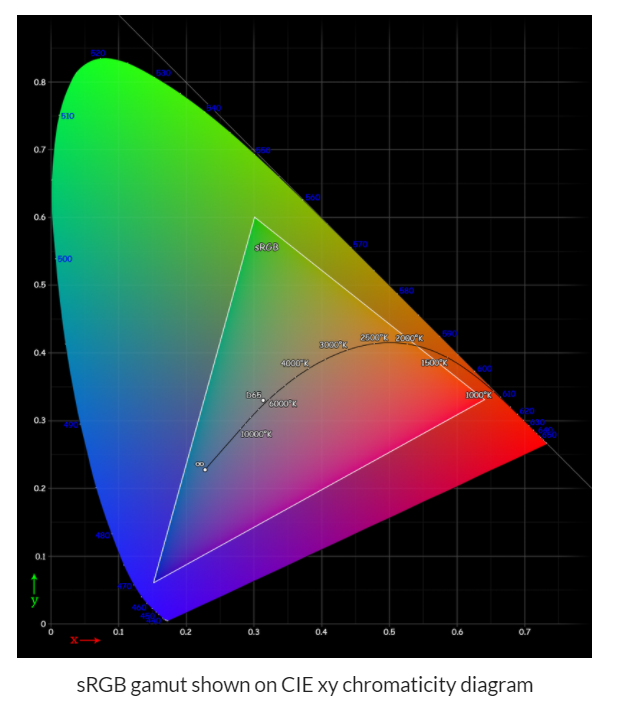
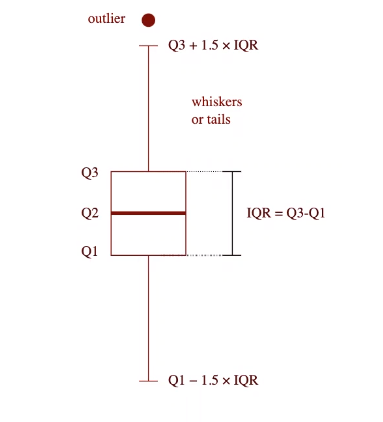
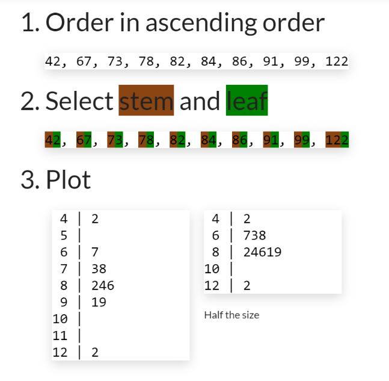
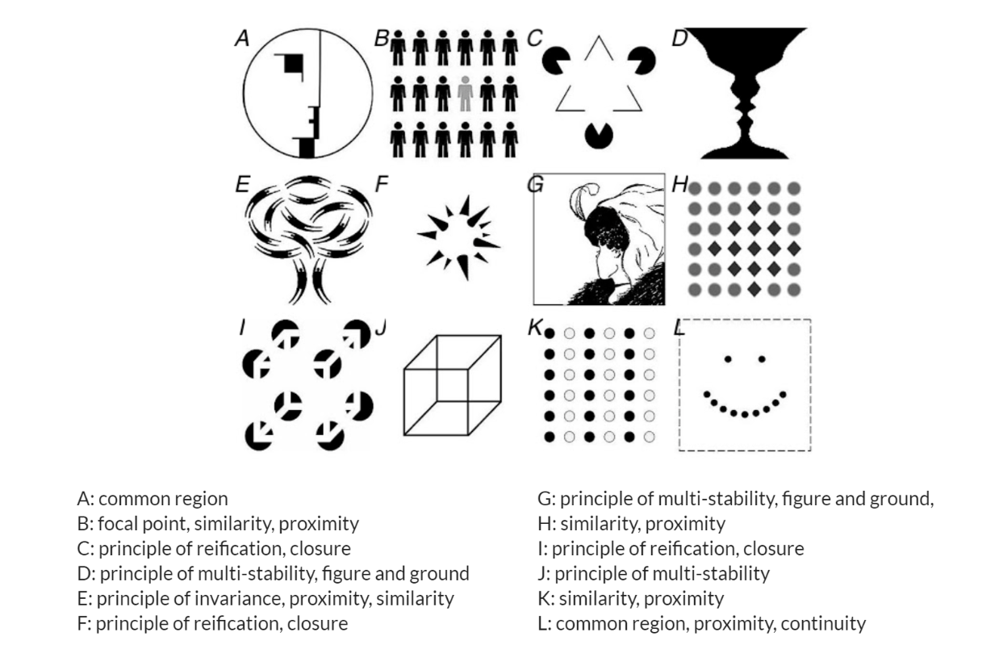

* 目录
    * [Week1. Introduction to Data visulization](#Week1-Introduction_to_data_visulization)
    * [Week2. Survey of visualization techniques](#Week2-Survey-of-visualization-techniques)
    * [Week3. Design space of visualizations, graphing in teh browser, introduction to D3 and Vega](#week3-Design-space-of-visualizations-graphing-in-the-browser-introduction-to-D3-and-Vega)
    * [Week4. Designing infographics and dashboards, D3 data join basics and loading data](#Week4-Designing-infographics-and-dashboards-D3-data-join-basics-and-loading-data)
    * [Week5. The eye and the visual brain, D3 scales and exes](#Week5-The-eye-and-the-visual-brain-D3-scales-and-exes)
    * Week6. Project proposal presentation
    * [Week7. pre-attentive features, interactive visualizations with d3](#Week7-pre-attentive-features-interactive-visualizations-with-d3)
    * [Week8. Colors, Colors in D3, Complex D3 graphs](#Week8-Colors-Colors-in-D3-Complex-D3-graphs)
    * [Week9. Depth Perception and design, maps](#Week9-Depth-Perception-and-design-maps)
    * [Week10. Statistics review, statistical graphic](#Week10-Statistics-review-statistical-graphic)
    * Week11. Graphing in notebooks
    * [Week12. Patterns, memory, visual encodings, semiology and gestalt.](#Week12-Patterns-memory-visual-encodings-semiology-and-gestalt)
    * Week13. Writing the article for the final project. Resolving technical issues.
    * Week14. Project predsrntation
* [quiz](#quiz)
    * [quiz4](#quiz4)


# Week1. Introduction_to_data_visulization

### 1.1 Data visualization


* compare data,information,knowledge and widsom


    data: 关键字，名词
    inforamtion：客观真理，事实
    knowledge：带有个人态度的内容，包含比较，等
    widsom： 带条件的事实，in...condition 等

&nbsp;

* data visualization in data science

[where is data visualization useful in data science](https://www.menti.com/cwi1vhv27g)


&nbsp;

* units of data & inforamtion 


&nbsp;

* Concepts:
    * **Data visualization** refers to the techniques used to communicate data or information by encoding it as visualobjcts (e.g. points, lines or bars) contained in graphics. The goal is to communicate information clearly and efficiently to users. It is one of the steps in data analysis or data science.
    * **information visualization** is the study of (interactive) visual representations of abstract data to reinforce human cognition.

You are aware of just 0.7% of what you experience.

&nbsp;

* Universal Capabilities
    * Typically in less than 1/10s
    * Does not require eye movements
    * Does not require focused attention
    * Color and boundary can be detected preattentively
        * Some color combinations are differentiated by everyone (blue/yellow)
        * Some symbols are understood across cultures(emoj)

* Information vs. secientific visualization
infovis vs. scivis<br>
 


&nbsp;

### 1.2 Examples and uses

* SIGNAGE ON MOVING WALKWAYS
    * Affordances define what actions are possible.
    * Signifiers specify how people discover those possibilities: signifiers are signs, perceptible signals of what can be done.

* Visualization uses: 
    communicate information / analyze & model data<br>
    
    * can replace complex calculations
    * can reveal complex patterns, trends and outliers 数字-->bar
    * can reveal features not otherwise apparent  体现隐藏的信息
    * can support memory and comprehension
    * can tell a story
    * can inform and engage more diverse audiences
    * visualizations are means to reach goals
    * information graphics (infographics) are devices whose aim is to help an audience complete certain tasks

* Design Considerations
    * designers & users
        
    * the form should be constrained by the goals of the visualization
    * form follows function
        * The shape of an object should primarily relate to its intended function or purpose


&nbsp;

### 1.3 Tools and software


* D3.JS
    * what is D3
        * Javascript client-side library
        * D3 stands for Data-Driven Documents
        * Uses recent HTML, SVG, and CSS
        * Primarily made to use SVG (not raster graphics, i.e., images)
    * what it does
        * Loads data in the browser memory
        * Create elements and bind data to elements within the document
        * Transform and customize elements
        * Transition elements in response to user input

&nbsp;
&nbsp;
&nbsp;

# Week2. Survey of visualization techniques
&nbsp;

### 2.1 Data
Data is plural (from the latin 'what is given')
Datum is a given piece of data
<br>

* Data types
    * Categorical
        * Nominal:  no natural ordering<br>
             eg., gender, ethnicity, nationality
        * Ordinal:  logical ordering but difference not meaningful 差异没有意义<br>
             eg., levels of happiness, levels of difficulty
    * ( Qualified categorical data 另一种分类方法
        * Binomial      eg., right/left,true/false
        * Dichotomous对立的 eg., hot/cold
            * Vs. non-dichotomous   eg,. Likert Chart)
    * Numerical
        * Ratio:  ordered, differences & doubling meaningful, 0 fixed<br>
             eg., temperature in Kelvin (40=2×20), length, height, dollar
        * Intervel:  ordered, differences meaningful, doubling not meaningful, 0 arbitrary<br>
             eg., temperature in Celsius (40≠2×20)/Fahrenheit, dates, locations

* Data Models
    * Conceptual<br>
         Semantic description of data entities and their relations
    * Logical<br>
         Implementation independent data design representation<br>
         eg., entity-relationship diagram
    * Physical<br>
         Implementation dependent details by which data is actually stored (with data types)

* Visualization Reference Model
    
<br>
<br>

### 2.2 Visualization Techniques
1. **Charts**
    * Dots
        * <u>Scatterplot</u>散点图  (2+ variables in Cartesian coordinate)
        * <u>Bubble chart</u>  点图 (3 continuous variables: bubble center (2) and radius (1))
    * Bars
        * <u>Bar chart</u>  (Bar length proportional to continuous variable)
        * <u>Lollipop chart</u> 注重具体高度 (Line length proportional to continuous variable and data point)
    * Bar layouts
        * <u>Coxcomb chart</u>鸡冠花图  (Same angle, radius encodes value, colors different categories. Stacked bar chart with radial layout.)
        * <u>Marimekko chart</u>  (Bar chart where the width encodes relative size. Also called Mekko chart.)
        * <u>Waterfall chart</u>  (Cumulative effects of sequence of positive and negative variations)
        
    * Pies
        * <u>Pie chart</u>  (Exploded pie chart. Pie charts, are a stacked bar charts in polar coordinates. Angle encodes proportion.)
        * <u>Donut chart</u>  (Pie Chart with centre area cut out. Angle encodes proportion.)
        
    * Lines
        * <u>line chart</u> (Trends on continuous variables, e.g., time-series)
        * <u>Sparkline</u>心电图  (Trends on small window size [Tufte 2004])
    * Line layouts
        * <u>Slopegraph</u>  (Shows data values, trends [Tufte 1983])
        * <u>Parallel coordinates</u>  (Multivariate data.)
        * <u>Radar chart</u>  (Multivariate data. Also named web, spider, star, cobweb, polar, or Kiviat.)
        
    * Area
        * <u>Area chart</u>  (Show cumulative or proportions and trends)
        * <u>Steramgraph</u>  (Type of stacked area graph which is displaced around a central axis, resulting in a flowing, organic shape)
        


2. **Graphs and Trees**
    * Hierarchies
        * <u>Dendrogram</u>系统树图  (From Greek dendro tree and gramma drawing.)
        * <u>Reingold-tilford tree</u>  (Hierarchical data as linked tree)
        

        * <u>treemap</u>  (Hierarchical data as nested rectangles. Area proportional to value.)
        * <u>sunburst</u>和鸡冠图很像  (Hierarchical data as rings. Center is root node. Angles are equal or proportional to value.)
        
    * Flowcharts
        * <u>Alluvial diagram</u> (Shows relations between multivariate data. Named after alluvial fans formed by soil deposited by streaming water.)
        * <u>Sankey Diagram</u>  (Magnitude of flow between nodes in a network)
        
    * <u>Networks network graph</u>  (Relationships (lines) between entities (nodes))
    * Matrix
        * <u>Heat map</u>  (Matrix values as colors)
        * <u>Chord Diagram</u>弦图表  (Shows directed relationships among a group of entities in a matrix)
        

3. **Clouds**
    * <u>Word Cloud</u>
    * <u>Bubble cloud</u>
    * <u>Circle packing</u>圆互相包含  (Bubble cloud technique with hierarchical information as enclosing circles)

4. **Temporal**
    * <u>Time series plot</u>  (Values ordered in time as a line chart)
    * <u>Gantt chart</u>工作日程表  (Schedule with tasks layed out on time axis)
    * <u>Timeline</u>  (Events layed out on time axis)
    

5. **Geospatial and Mapping**
    * Thematic maps主题地图
        * <u>Choropleth</u>等值线图  (Areas are shaded or patterned in proportion to variable)
        * <u>Proportional symbol map</u>  (Scaled symbols show data for areas/locations. Also called Graduated Symbol Map.)
        * <u>Dot map</u>  (Can be used to locate each occurrence of a phenomenon. One-to-one or one-to-many.)
        

        * <u>Cartogram</u>统计图  (Area used to display value. Distortion used to show continuous variables)
        * <u>Isopleth</u>等值线  (Use contours等高线 to show continuous variables. Also called Isarithmic.)
        
    * Other named
        * <u>Topographic</u>  (Detailed quantitative representation of land relief using contour lines)
        * <u>Nautical</u>航海的  (Charts of maritime/coastal area)
        * <u>Image based</u>  (Using satellite or aerial imagery)
        

<br>
<br>

### 2.3 Introduction to WEB technologies


* asynchronous javascript & html (AJAX)

    AJAX是指一种创建交互式、快速动态网页应用的网页开发技术，无需重新加载整个网页的情况下，能够更新部分网页的技术。
    通过在后台与服务器进行少量数据交换，Ajax 可以使网页实现异步更新。这意味着可以在不重新加载整个网页的情况下，对网页的某部分进行更新。


* Web Languages
    * 1. HTML (hypter-text markup language)
            * defines the page semantics or meaning
            * whitespace and line breaks disregarded
            * HTML documnet as a tree of html <u>elements</u> (tag with attributes)
            * two attibures (class & id) used to identify elements
            * basic elements
                
            * elements example : svg
                
    * 2. CSS (Cascading Style Sheets)
            * used to define the appearance of HTML elements
            * including in web pages<br>
                
            * selectors <br>
                div.foo (div elements with <u>class</u> foo)<br>
                div #foo (elements with <u>id</u> foo inside a div) have space before # means inside <br>
                div,.foo (div elements <u>and</u> elements with class foo)<br>
                div p.foo (elemetns with class foo <u>in</u> a p in a div)<br>
    * 3. Javascript
            * implemented in browsers and non-browser, e.g., node
            * uses in browsers<br>
                user interaction<br>
                asynchronous communications<br>
                control the browser<br>
                alter the content<br>
            * including in web pages<br>
                
            * main features<br>
                a. object-oriented language 面向对象
                ```js
                //denotes a comment
                obj = {first: 'Joseph', last: 'Priestley'}; //object literal
                obj.first  //'Joseph'
                ```
                b. everything is mutable可变的
                ```js
                obj = {first: 'Joseph', last: 'Priestley'};
                obj.first = 'Joe'  //now first is 'Joe'
                ```
                c. dynamic typing
                ```js
                //primitive types
                var foo = true;       //Boolean
                var foo = null;       //Null
                var foo = undefined;  //Undefined
                var foo = 2.3;        //Number
                var foo = 'bar'       //String
                ```
                d. function level scope
                ```js
                var b = 5;  //global scope, i.e., at the top of the script
                function f(a) {
                var b = 3;  //local scope, i.e., within the scope of the function
                return a + b;
                }
                b;  //5
                ```
                e. first-calss functions
                ```js
                //functions treated similar to any other variable
                var pi = function() { return Math.PI; }  //assign functions to a variable

                function add(a, f) { return a + f(); }
                add(1, pi);  //pass functions as argument

                function addPi() {
                return function(a) {  //return functions
                    return a + Math.PI;
                }
                }
                ```
            * Hoisting<br>
                Hoisting refers to the moving of variable declarations at the top of their scope when the script is parsed
                
            * Closure<br>
                A closure is the combination of a function and the lexical environment within which that function was declared.
                ```js
                function exampleClosure(arg1, arg2) {  //closure example
                    var localVar = 2;
                    function exampleReturned(innerArg) {  //inner function (declaration)
                        return ((arg1 + arg2) / (localVar + innerArg));
                    }
                    return exampleReturned;  //reference to inner function
                }

                var globalVar = exampleClosure(2, 4);

                console.log(globalVar);  //[Function: exampleReturned]

                globalVar(4);  //1 = ((2 + 4) / (2 + 4))
                ```


&nbsp;
&nbsp;
&nbsp;

# week3. Design space of visualizations, graphing in the browser, introduction to D3 and Vega
&nbsp;

**Infographics** (a clipped compound of "information" and "graphics") are graphic visual representations of information, data or knowledge intended to present information quickly and clearly. They can improve cognition by utilizing graphics to enhance the human visual system's ability to see patterns and trends.

A **dashboard** is a type of graphical user interface which often provides at-a-glance views of key performance indicators (KPIs) relevant to a particular objective or business process. In other usage, "dashboard" is another name for "progress report" or "report.".

<br>

### 3.1 Design space and design trade-offs
|less complex|more complex|explain|example|
|-|-|-|-|
|figuration|abstraction|measures the distance from referent to the representation|纸币图片 vs. 钱币符号|
|decoration|functionality|measures the amount of informative content|有装饰的图表 vs. 直白的图表|
|lightness|density|measures the amount of content displayed in relation to space|一张图  vs.多个图平铺展示|
|undimensionality|multidimensionality|measures the number of layers and forms used to encode the data|一张图 vs.多张图叠放展示|
|familiarity|originality|measures how challenging the forms are for the user to understand|好懂的图 vs. 难懂的图|
|redundancy|novelty|measures the number of times things are explained|解释很多次的  vs. 只出现一次的|

&nbsp;
&nbsp;

### 3.2 Graphing in the browser

* Document Object Model 
    * 把HTML解析成为树状的结构，并通过改变内容实现交互
        
    * DOM example
        

<br>

* CSS Box Model 
    * two types: 
        * inline: occupy the space bounded by the tag<br>
            ```<span>会显示在同一行 </span>```
        * block: start on a new line and take up the full width<br>
            ```<div>换行显示</div>```   

* global vs. element spacific attributes
    * global: (id, class, style)
        ```css
        <!-- Use id to reference containers for dynamic charts -->
        <div id="chart1"></div>  
        <svg id="chart2"></svg>

        <style>
        div.bar { background-color: red; }
        circle.dot { fill: red; }
        </style>

        <!-- Use class to apply common styles -->
        <div class="bar" style="width: 600px">bar 1</div>

        <svg style="background-color: lightpink">
        <circle class="dot" cx="5" cy="5" r="2"/>
        </svg>
        ```
        * style attribute (margins, borders, padding)
            
    * element spacific attributes:
        ```css
        <!-- Use element specific attributes to place and size -->
        

        <svg style="background-color: lightpink">
        <circle cx="5" cy="5" r="2"/>
        </svg>
        ```
* SVG
    * explain:
        * SVG elements are drawn in the <svg>
        * Coordinate system in pixels starting up left corner of <svg>
        * Painter's algorithm defines drawing order:
            * coding order is drawing order (last drawn on top)
    * HTML VS. SVG FOR CHARTING
        
    * svg basic shapes attributes 
        * positions & size
        * fill (interior color)
        * stroke (border color)
            ```javascript
            <rect x="10" y="10" width="80" height="80" rx="5" ry="5" fill="orange"/>

            <circle cx="150" cy="50" r="40" fill="green"/>

            <ellipse cx="260" cy="50" rx="50" ry="25" fill="brown"/>

            <line x1="320" y1="20" x2="380" y2="80" stroke="blue"/>

            <polyline points="420,35 490,65 490,35 420,65" stroke="red" fill="none"/> 

            <polygon points="560,10 600,30 600,70 560,90 520,70 520,30" fill="tan"/> 
            ```
        * attributes defaults
            * Positions & size (e.g., x, y, x1, y1, x2, y2, cx, cy, width, height, r, rx, ry) defaults to 0 (圆会显示不全)
            * Fill defaults to black for shapes and none for text
            * Stroke defaults to 'none' 
        * SVG styling properties
            * Most ***but not all*** SVG attributes have CSS styling properties
                
    * text
        * <<text>> x, y defaults to the bottom left of the text
            


### 3.3 Introduction to D3
* D3 is
  
    * **TL;DR.**JavaScript library to bind data to the DOM, i.e., vocabulary of graphical marks come directly from web standards: HTML, SVG, and CSS.
* To generate the graphic in the page:
    1. Get the data
    2. Use a D3 to map data as HTML elements that the browser renders in the page
* 2 ways to use:
    1. Select & append
    2. With data join mechanism

* Programming Paradigms & Visualization Tools
    

* About D3
    * Library based on modern Web standards
    * Created and maintained by Mike Bostock
    * Website: https://d3js.org
    * Documentation: https://github.com/d3/d3/wiki
    * Gallery: https://github.com/d3/d3/wiki/Gallery
    * D3 stands for Data-Driven Documents
    * Concentrates on the data as opposed to the representation
    * High expressiveness: good for custom/novel forms
* What D3 does
    1. Loads data in the browser (DOES NOT HIDE THE DATA!)
    2. Binds data to document elements
    3. Transforms elements by interpreting each element’s bound datum and setting its visual properties
    4. Transitions elements between states in response to user input
* BASIC D3 OPERATIONS
    1. Select elements
    2. Add new elements to selected elements
    3. Delete selected elements
    4. Modify selected elements for position and style
* Function Chaining (Code Design Pattern)
    * Allows to write code that is simpler to underst:
        ```js
        obj.method3(obj.method2(obj.method1()));

        var s = obj.method1();
        s = s.method2();
        s = s.method3();

        obj.method1()
          .method2()
          .method3();
        ```
    * Is implemented using "*this*":
        ```js
        var obj = {
          method1: function() {
            console.log('method1');
            return this;  //in Javascript this refers to the current object instance
          },
          method2: function(a) {
            console.log('method2');
            return this;
          } 
        };

        obj.method1().method2();
          method1
          method2
        ```
* How to use D3
    1. SELECT ELEMENTS
        * A D3 selection is a list (or array) of nodes with a parent
        * select() and selectAll() return a selection
        * selector is a CSS selector or a function
        * Chaining syntax allows to select in a selection
        ```js
        var selection = d3.select(selector);  //select first matching element in the document
        var selection = d3.selectAll(selector);  //select all matching elements in the document

        var selection = selection.select(selector);  //select first matching element in the selection
        var selection = selection.selectAll(selector);  //select all matching elements in the selection

        var s = d3.select('body');  //selects <body> in <html>
        s.select('p');  //selects first <p> in <body>

        d3.select('body')  //same as above using chaining
          .select('p');

        d3.selectAll('p');  //selects all <p> in parent
        d3.select('#chart');  //selects first element in parent with id="chart"
        d3.selectAll('.red');  //selects all elements in parent with class="red"
        ```
    2. ADD NEW ELEMENTS
        * Adding is done with a selection
        * selection.append(type) appends a new element to the last child of each selected element
        * selection.insert(type[, before]) inserts a new element before the first element matching the specified before selector for each selected element
        * Returns the added elements!
        ```js
        <body></body>
        d3.select('body')
            .append('p')  //append p as the last child of body
            .text('Text0');  //set text to "Text0"
        <body><p>Text0</p></body>
        d3.selectAll('p')  //selects all elements of type p
            .append('p')  //set text to "Text1"
            .text('Text1');  //
        <body><p>Text0<p>Text1</p></p></body>
        ```
    3. DELETE SELECTED ELEMENTS
        * Deleting is done with a selection
        * selection.remove() Removes the selected elements from the document
        * Returns the removed elements
        ```js
        <body><p>Text0</p></body>
        d3.selectAll('p')  //selects all elements of type p
          .remove();  //removes selected elements
        <body></body>
        ```
    4. MODIFY SELECTED ELEMENTS
        * Modifications are done on the selection
        * selection.text(text) changes the text of HTML elements elements
        * selection.style(style) sets the style of HTML elements elements
        ```js
        <p>Paragraph1</p>
        <p>Paragraph2</p>
        d3.selectAll('p')  //select all p in document
          .text('Paragraph');
        d3.select('p')  //select first p in document
          .text('paragraph2');
          .style('color', 'red');
        ```
    * USING SELECT AND APPEND FOR GRAPHING
        ```js
        <div id="chart"></div>

        <script>
        d3.select('#chart')
          .append('div')
          .attr('width', '300px')
          .attr('background-color', '#eee')
          .text('300,000');
        </script>
        ```
* D3 data join
    * Mechanism to bind data to elements in the document
    * Central to D3 operations
    * Works on the selection!
        
    * data join example
        
    * In the data join configurations are made with functions taking datum and index as arguments
        
    * In the data join data() must be an array
        ```js
        var dataset = [1, 2, 3]; //array!

        d3.select('body')
          .selectAll('p')
          .data(dataset)
          .enter()
          ...
        ```
        * Examples arrays that can be passed to data()
            ```js
            var data = [  //array of objects
              {name: 'A', frequency: .08167},
              {name: 'B', frequency: .01492},
              {name: 'C', frequency: .02780},
              {name: 'D', frequency: .04253},
              {name: 'E', frequency: .12702}
            ];

            var data = [  //array of arrays
              [ 0,  1,  2,  3],
              [ 4,  5,  6,  7],
              [ 8,  9, 10, 11],
              [12, 13, 14, 15]
            ];
            ```

### 3.4 Introduction to Vega and Vega-lite
* define
    * **TL;DR.** Graphic & data described as a JSON (Javascript) object
* To generate a graphic in the page:
    1. Write the description
    2. Use a Javascript library that renders the description in the page
* vega-lite and vega
    


&nbsp;
&nbsp;
&nbsp;

# Week4. Designing infographics and dashboards, D3 data join basics and loading data
[quiz](#quiz4)

&nbsp;
&nbsp;

### 4.1 Designing infographics and dashboards

##### infographics:
1. Understand
    * Information to communicate
    * User capabilities, knowledge of topic, context and display size
2. Method
    * a. Seek depth:
    * b. Clarify
    * c. Add Boom effect

##### Dashboards
1. Understand
    * Information to communicate
    * User capabilities, knowledge of topic, context and display size
2. Do
    * Use a grid layout
    * Most important at the top
    * Use annotated & labeled big numbers
    * Simplify
    * Optimize visual queries
    * Use safe fonts, colors consistently
    * 5-second rule: topic, key trends, how to explore (monitoring applications!)


<table style = 'font-size:90%'>
    <tr>
        <td rowspan="4">1. seek depth</td>
        <td>Wheels</td>
        <td>Density-Lightness<br>Multidimen-Uni</td>
    </tr>
    <tr>
        <td>Cairo's recommendations</td>
        <td>1. Move position of graphic at least 10% towards density and multidimensionality<br>2. Include inner layers as necessary based on story and focus</td>
    </tr>
    <tr>
        <td>Both</td>
        <td>1. Define where your graphic stands in terms of density and dimensionality<br>2. Organize in layers, starting with a summary<br>3. Structure the layers in logical order<br>4. Most important at the top</td>
    </tr>
    <tr>
        <td>Dashboard recommendations</td>
        <td>1. Use a grid layout<br>2. Use annotated & labeled big numbers<br>3. 5-second rule: topic, key trends, how to explore (monitoring applications!)</td>
    </tr>
    <tr>
        <td rowspan="4">2. Clarify</td>
        <td>Wheels</td>
        <td>Abstraction-Figuration<br>Functionality-Decoration</td>
    </tr>
        <tr>
        <td>Cairo's recommendations</td>
        <td>1. Do not simplify but clarify<br>2. Use space first to explain and develop the story<br>3. Never dumb down your data</td>
    </tr>
    <tr>
        <td>Both</td>
        <td>1. Think about structure first then eye-candy<br>2. Think about how data should be organized before thinking about style<br>3. Optimize visual queries</td>
    </tr>
    <tr>
        <td>Dashboard recommendations</td>
        <td>1. Simplify<br>2. 5-second rule: topic, key trends, how to explore (monitoring applications!)</td>
    </tr>
    <tr>
        <td rowspan="4">3. Boom Effect</td>
        <td>Wheels</td>
        <td>Originality-Familarity<br>Novelty-Redundancy</td>
    </tr>
        <tr>
        <td>Cairo's recommendations</td>
        <td>1. Experiment (carefully) with novel (original) forms</td>
    </tr>
    <tr>
        <td>Both</td>
        <td>1. The more original the form the more redundancy<br>2. Explain novel forms with text and other graphics<br>3. Use safe fonts and colors consistently</td>
    </tr>
    <tr>
        <td>Dashboard recommendations</td>
        <td>1. 5-second rule: topic, key trends, how to explore (monitoring applications!)</td>
    </tr>
</table>


&nbsp;
&nbsp;
### 4.2 Function and esthetics, minimalistic visualizations
##### 1. Tufte's design principle
Elegance in visuals is attained when the complexity of the data matches the simplicity of the design<br>
(当数据的复杂性与设计的简洁性相匹配时，就可以获得视觉上的优雅)

* Data-ink Ratio
数据墨水是图形上的不可擦除的核心内容<br>
Data-ink ratio = Data / Total ink used to print to graphic<br>
               = Proportion of a graphic’s ink devoted to the **non-redundant** display of data-information<br>
               = 1.0−Proportion of a graphic that can be erased without loss of data-information<br>

* Tufte's design principle expressed with teh data-ink ratio
Above all else show data<br>
Maximize the data-ink ratio<br>
Erase non-data-ink<br>
Erase redundant data-ink<br>
Revise and edit<br>

* Chartjunk
The interior decoration of graphics generates a lot of ink that does not tell the viewer anything new.<br>
The purpose of decoration varies — to make the graphic appear more scientific and precise, to enliven the display, to give the designer an opportunity to exercise artistic skills.<br>
Regardless of its cause, it is all non-data-ink or redundant data-ink, and it is often chartjunk.<Br>

##### 2. Nigel Holmes' design principle
Use humor to instill affection in readers for numbers and charts
(用幽默向读者灌输对数字和图表的喜爱)
* Screen Time spent looking at different chart elements<br>
    
* Comprehension and Memorability<br>
    

&nbsp;
&nbsp;
### 4.3 D3 data join basics
##### 1. Stress test
```html
d3.select(A)
  .selectAll(B)
  .data(dataset)
  .enter()
  .append(C)
  .text(function(d){return d;});
```
1. dataset 一定要是个array
2. selectAll() 是count功能
    * 在enter()后，如果B和C相等，在A中已经有n个C，则从第n个数开始modify原数据，前n个值保持不变
    * 在enter()后，如果B和C不相等，则直接append，和count没有关系
3. 每个enter()只会加入或修改和dataset数量一样的值。

##### 2. Customize the selection
* HTML ELEMENTS
    * .attr() to set attributes, e.g., class
    * .style() to set style parameters
    * .text() to set inner text
        ```js
        var el = d3.select('body')  //select body
        var el = d3.select('#div0')  //select div with id div0
        var el = d3.select('#svg0')  //select svg with id svg0
        ```
* SVG ELEMENTS
    * .attr() to place and size, e.g., x, width
    * .style() to configure and update appearance
        ```js
        //Statically
        <svg id='svg0' width='300' height='100'></svg>
        //Dynamically
        var svg = d3.select('body')
          .append('svg')
          .attr('width', '300')
          .attr('height', '100');
        ```

##### 3. Multiple elements per data point
* using to draw similar shapes or text
    * 
    * 
    * 


&nbsp;
&nbsp;
### 4.4 Loading data in D3
* Explain
    * Browsers cannot access or load local data (security)!
    * Browsers can load data files by issuing an http request to a server
    * Asynchronous process:
        * AJAX calls
        * d3.csv(), d3.json() (callbacks up to v3, now promises)
    * Depending on the format Javascript dynamic typing not sufficient

* ES6 PROMISES 封装异步操作
    * A promise allows to associate handlers with asynchronous actions
        ```js
        let myFirstPromise = new Promise((resolve, reject) => {
          // We call resolve(...) when what we were doing asynchronously was successful, and        reject(...) when it failed.
          // In this example, we use setTimeout(...) to simulate async code. 
          setTimeout( function() {
            resolve("Success!")  // Yay! Everything went well!
          }, 250) 
        }) 

        myFirstPromise.then((successMessage) => {
          // successMessage is whatever we passed in the resolve(...) function above.
          // It doesn't have to be a string, but if it is only a succeed message, it probably       will be.
          console.log("Yay! " + successMessage) 
        });
        ```
* Converting to numbers
    * parseInt() and parseFloat()
        ```js
        parseInt('10');  //int 10
        parseFloat('10.1');  //float 10.1
        ```
    * Coercion with unary + operator (faster)
        ```js
        +''  //int 0
        +'1'  //int 1
        +'1.1'  //float 1.1
        ```
* JSON FORMAT
    * Stands for Javascript object notation
    * Text format
    * Data is represented as a Javascript object
    * Keys must be quoted (strings)
        ```json
        [
          {"year": 1997, "make": "Ford", "model": "E350", "length": 2.34},
          {"year": 2000, "make": "Mercury", "model": "Cougar", "length": 2.38}
        ]
        ```
* Loading csv files
    
* Loading json files
    ```js
    d3.json("cars.json").then(function (data) {
        console.log(data);
        //prints to the console
        //[{year: 1997, make: "Ford", model: "E350", length: 2.34},
        // {year: 2000, make: "Mercury", model: "Cougar", length: 2.38}]
    });
    ```


&nbsp;
&nbsp;
&nbsp;

# Week5. The eye and the visual brain, D3 scales and exes

&nbsp;
&nbsp;

### 5.1 The eye and the visual brain

1. Visible spectrum wavelengths from **400-700nm** (in nanometers)<br>
    

2. High-resolution (高分辨率) vision in central 1-2° of field of view<br>
    

3. Retina photoreceptors: Cones and Rods
    * Retina: layer containing cells sensitive to light
    * Cones: 感光，分辨颜色
    * Rods: 只能感觉到黑和白 
    

4. Two vision based on looking way
    * SACCADES (飞快扫视)<br>
        Eye movements (about 3 each second)<br>
        Accompanied by periods of blindness<br>
        more than 200ms to initiate<br>
        Fastest movements in body (up to 900os−1)<br>

    * FIXATIONS (固定)<br>
        A glimpse<br>
        When visual information is acquired<br>
        Task dependent<br>

5. The visual system
    * Eyes, nerves (optic nerve from eyes to brain) and visual cortex (areas V1-5)
        * 眼睛、神经(眼睛到大脑的视神经)和视觉皮层(V1-5区)
        * blind spot 是因为有一块optic nerve，导致那一块无法感知。
    * information processing in the visual system
        <table style = 'font-size:90%'>
        <tr>
        <td>Bottom-up or data-driven</td>
        <td>Top-down or schema-driven</td>
        </tr>
        <tr>
        <td>Perception results from transforming sensory input into higher level information</td>
        <td>Signals from the eye are integrated and compared to examples in memory</td>
        </tr>
        <tr>
        <td>Knowledge and attention influence perception(认知)</td>
        <td>Object knowledge directs the eyes and the feature extraction processing</td>
        </tr>
        </table>
        


6. Visual Queries
    用bottom-up和top-down两种方法找到问题的答案，比如在chart中找到信息
    * Visual queries and design considerations (said by C.Ware)
        * **Visual query**: a pattern cognitively specified, that if found in the display will contribute to the solution of a problem
        * **Visual thinking** consists of a series of acts of attention, driving eye movements and tuning our pattern-finding circuits
        * Carefully craft visualizations to optimize visual queries

7. Inattentional Blindness (不注意的丢失了信息)
    * Reasons:
        1. Failure to detect an unexpected stimulus that is fully visible
        2. Limited attention allows to focus on one thing at the time
        3. The brain prioritizes what to focus on

8. Related Implications for Design
    * For **designers** ... it is important to know what kinds of visual information the brain can process efficiently [Ware].
    * **Be aware of inattentional blindness**. Never show simultaneous animations on different parts of the screen [Cairo].
    * **Do not use too many competing stimuli**. Filling graphic with objects colored in pure accent tones disorients users [Cairo].
    

&nbsp;
&nbsp;

### 5.2 D3 scales and axes

**Scales**: Encodings used to map data to visual representations
**Axes**: Visual representations of the scale that let us read data values

1. Annotations:
    * Axes<br>
        * axis
        * axis labels
        * axis values
        * tick marks
        * tick mark labels
        * grid lines
    * Legend 图例<br>
        * title
        * keys
        * key labels

2. Types of scales:<br>


3. D3 scales and axes
* d3 / d3-scale
    * Simplify mapping data to representation
    * Facilitates complex data transformations
|Continuous|Ordinal|
|-|-|
|Quantitative data<br>Continuous domain and range|Qualitative data<br>Discrete domain|
|<u>Linear</u><br><u>Time</u><br>Power<br><u>Log</u><br>Quantize (rounds continuous data to set of discrete values)<br>Quantile (computes quantiles from a sample population)<br>Sequential<br>Threshold (allows to specify arbitrary breaks)|<u>Ordinal</u><br><u>Band</u><br><u>Point</u>|

* D3.SCALELINEAR() 
    y = ax + b
```js
dataset = [100, 120, 150];

var x = d3.scaleLinear()  //function are objects in js
  .domain([d3.min(dataset), d3.max(dataset)])  //extent of the data
  .range([0, 100]);  //range is the extent of the svg in pixels

x(125);  //50
```

* D3.SCALETIME()
    y = at + b
```js
//use Date() to specify time in milliseconds
var x = d3.scaleTime()
  .domain([new Date(2018, 8, 20), new Date(2018, 12, 12)])
  .range([0, 960]);

x(new Date(2018, 11, 30));  //evaluate for date
x(Date.now());  //evaluates scale for today's date

```
* D3.SCALELOG()
    y = alog(x) + b
```js
var x = d3.scaleLog()
  .domain([1, 10000])
  .range([0, 1000])
  .base(10);

x(10);  //250
x(10000);  //1000
```

* D3.SCALEORDINAL()
适用于离散的domain
```js
var x = d3.scaleOrdinal()
  .domain(['0', '1', '2'])  //discrete domain
  .range([0, 1, 2]);

x('0');  //0
x('1');  //1
```

* D3.SCALEBAND()
柱状图
```js
var x = d3.scaleBand()
  .domain(['0', '1', '2'])  //discrete domain
  .range([0, 600])
  .paddingInner(0.05);  //set inner padding in [0, 1], dafaults to 0.

x('0');  //0
x('1');  //303.4
x.bandwidth();  //193.2
```

* D3.SCALEPOINT()
same as scaleBand() with bandwidth = 0
```js
var x = d3.scalePoint()
  .domain(['0', '1', '2'])  //discrete domain
  .range([0, 600]);

x('0');  //0
x('1');  //300
```

<br>
### d3 / d3-axis
Simplify drawing of axes

* Drawing D3 axes
```js
var svg = d3.select('#svg02')
  .attr("width", 400)
  .attr("height", 400);

// 1. CREATE SCALE FOR AXIS
var scale = d3.scaleLinear()
  .domain([0, 10])
  .range([0, 300]);

// 2. CREATE AXIS AND SET THE SCALE
var axis = d3.axisLeft(scale);

// 3. ADD AXIS IN A GROUP AND PLACE
svg.append("g")
  .attr("transform", "translate(50,50)")
  .call(axis);  //call axis to draw
```

* 4 types of D3 axes


```js
var svg = d3.select('#svg03')
  .attr("width", 400)
  .attr("height", 400);

var scale = d3.scaleLinear()
  .domain([0, 10])
  .range([0, 300]);

//vertical axis with ticks on the left
var axis_l = d3.axisLeft(scale);

//vertical axis with ticks on the right
var axis_r = d3.axisRight(scale);

//horizonal axis with ticks on the top
var axis_t = d3.axisTop(scale);

//vertical axis with ticks on the bottom
var axis_b = d3.axisBottom(scale);

svg.append("g")
  .attr("transform", "translate(50,50)")
  .call(axis_l);

svg.append("g")
  .attr("transform", "translate(350,50)")
  .call(axis_r);

svg.append("g")
  .attr("transform", "translate(50,50)")
  .call(axis_t);

svg.append("g")
  .attr("transform", "translate(50,350)")
  .call(axis_b);
```

* 4 types of D3 axes


```js
<style type="text/css">
  #svg04 path {
    stroke: blue;
  }
  #svg04 .dashed-axis path {  //axis is <path>
    stroke: orange;
    stroke-dasharray: 5,5;
  }
  #svg04 .tick line {  //ticks are <line>
    stroke: green;
    stroke-width: 5px;
    shape-rendering: crispEdges;
  }
  #svg04 .tick text {
    stroke: red;
    font-family: sans-serif;
    font-size: 16px;
  }
</style>

<script>
  var svg = d3.select('#svg04')
	.attr("width", 400)
	.attr("height", 400);
  var y = d3.scaleLinear().domain([0, 10]).range([300, 0]);
  var x = d3.scaleLinear().domain([0, 10]).range([0, 300]);
  var axis_l = d3.axisLeft(y).ticks(3);
  var axis_b = d3.axisBottom(x).ticks(3);
  svg.append("g")
    .attr("transform", "translate(50,50)")
    .attr('class', 'dashed-axis')
    .call(axis_l);
  svg.append("g")
    .attr("transform", "translate(50,350)")
    .call(axis_b);
</script>
```

* AXES LABELS AND GRID LINES


```js
<style>
  .label {
    font-size: 18px;
    text-anchor: middle;
	alignment-baseline: middle;
  }

  .dashed-axis path {
	stroke-dasharray: 3, 3;
  }
</style>
<script>
  var svg = d3.select('#svg05').attr("width", 400).attr("height", 400);

  var y = d3.scaleLinear().domain([0, 10]).range([300, 0]);
  var x = d3.scaleLinear().domain([0, 10]).range([0, 300]);
  var axis_l = d3.axisLeft(y)
  var axis_b = d3.axisBottom(x)

  svg.append("g")
    .attr("transform", "translate(50,50)")
    .call(axis_l);

  svg.append("g")
    .attr("transform", "translate(50,350)")
    .call(axis_b);

  var axis_hg = d3.axisBottom(x)  //create and place grid lines
    .tickSize(0)
    .ticks(0);

  var axis_vg = d3.axisLeft(x)
    .tickSize(0)
    .ticks(0);

  svg.append("g")
    .attr("transform", "translate(50,200)")
    .attr('class', 'dashed-axis')
    .call(axis_hg);

  svg.append("g")
    .attr("transform", "translate(200,50)")
    .classed('dashed-axis', true)
    .call(axis_vg);

  svg.append("text")  //create and place labels
    .attr("x", 200)
    .attr("y", 385)
    .classed('label', true)
    .text("axisBottom");

  svg.append("text")
    .attr("x", -200)
    .attr("y", 15)
    .classed('label', true)
    .attr("transform", "rotate(-90)")
    .text("axisLeft");
</script>
```

* MARGIN CONVENTION TO PLACE THE CHART


```js
var margin = {top: 20, right: 20, bottom: 20, left: 20};  //step1: set margin
var width = 600 - margin.left - margin.right,  //step2: set width and height
    height = 300 - margin.top - margin.bottom;

var svg = d3.select("body").append("svg")  //step3: set-up svg
  .attr("width", width + margin.left + margin.right)
  .attr("height", height + margin.top + margin.bottom)
  .append("g")
  .attr("transform", "translate(" + margin.left + "," + margin.top + ")");
```


# Week7. pre-attentive features, interactive visualizations with d3

&nbsp;
&nbsp;

### 7.1 Pre-attentive features
##### 1.  preattentive processing (前注意处理)
    前注意处理是来自环境的信息的潜意识积累。所有可用信息都经过前注意处理。然后，大脑过滤并处理重要的事情。通过有意识的处理，选择与人所想的具有最高显着性或相关性的信息，以进行进一步和更完整的分析。
* features:
    * Universal property
    * Uses information from a single glimpse
    * <200ms on large multi-element displays
    * Does not involve attention
    * Independent of:
        * Practice
        * Familiarity with the features
        * Number of distractors
    * Can help present information at a glance
<br>

##### 2.  Targets, distractors & visual features
* **Feature interference** occurs when a visual feature (shape & color) that is shared between the target and distractors interferes with the preattentive process(一眼看不到target的情况)
* **Feature hierarchy** :
    * Some visual features interfere more than others.
    * how certain preattentive features are easier to detect than others
    * e.g., 'color' is easier to detect than 'shape'
* A **conjunction search** is a visual search involving a combination of non-unique features. In general a conjunction search cannot be done preattentively.
<br>

##### 3.  Preattentive tasks
<table>
<tr>
<td>Target detection</td>
<td>Detect the presence or absence of a target element with a unique visual feature within a field of distractor elements</td>
</tr>
<tr>
<td>Boundary detection</td>
<td>Detect a texture boundary between two groups of elements, where all of the elements in each group have a common visual property</td>
</tr>
<tr>
<td>Region tracking	</td>
<td>Track one or more elements with a unique visual feature as they move in time and space</td>
</tr>
<tr>
<td>Counting & estimation</td>
<td>Count or estimate the number of elements with a unique visual feature</td>
</tr>
</table>
<br>

##### 4.  Preattentive features
* Visual features supporting preattentive processing: 
    * Color
    * Orientation
    * Size
    * Motion
    * Stereoscopic depth 立体景深
<br>

##### 5.  POP-OUT EFFECT (突出效应)
有些target很好找，有些很不好找。
Pre-attentive tasks applied to visual queries 前注意任务应用于视觉查询
* maximizing the pop-out effect
    * In feature space, the greater the distance between target and distractors the greater the pop-out effect

&nbsp;
&nbsp;

### 7.2 Continuity of visual queries
* Inattentional blindness (不注意的)
    * Failure to detect an unexpected stimulus that is fully visible
    * Can usually only focus on one thing at the time
    * The brain has to prioritize what to focus on
* Change blindness (看变化的事物)
    * Not detecting a brief transitory event occurring in the visual field
    * Happens when we blink or move our eyes quickly
    * Involves very short term (iconic) memory
<br>

* **Animated transitions**: 
    * definition: Animations between an initial and a final state
    * Ensures object constancy (let's us track objects) during:
        * Filtering data
        * Reordering data
        * Resizing operations
        * Changing forms...
&nbsp;
&nbsp;

### 7.3 Interactive visualizations with D3
##### 1.  Events and handling events
* JavaScript event
    |-|-|
    |-|-|
    |Resource Events (e.g., load)|Network Events|
    |Focus Events (e.g., focus)|Websocket Events|
    |Form Events (submit)|Session History Events|
    |View Events (e.g., resize)|CSS Animation Events (animationstart)|
    |Keyboard Events (e.g., keypress)|Printing Events|
    |Mouse Events (e.g., click)|Clipboard Events|
    |Drag & Drop Events|Text Composition Events|
    |Media Events (e.g., play)|CSS events|
    |SVG events (SVGResize)|Script events|
    |Document events|Window events|
    |Popup events|DOM mutation events|
    |Touch events|...|
    (most used in visualizations)

* **Event handling**
    Once emitted, events are **propagated** in the DOM tree and processed by elements through event listeners
    * Event listener:
        * Function attached to elements used to handle specific events
        * The handler is called according to a specific propagation phase

    * Event propagation(传播) phases
        

    * JavaScript event loop
        
        * DOM level 0 inline (one event handler per element)
        * DOM level 0 traditional (one event handler per element)
        * DOM level 2 (multiple event handlers per element)
    * Headling events with css hover pseudo-class
        * A **CSS pseudo-class** is a keyword added to a selector that specifies a special state of the selected element(s).
    * Headling events with D3
        * d3.select("class").on("click", function(event) {})
    * Headling events in D3 data join
        * read data and use .enter()


##### 2.  Updating visualizations
*  Updating the data
    * |Js array methods|explanation|
      |-|-|
      |*array.map*|returns array where a function is called on every element|
      |*array.sort*|sorts in place the elements of the array.|
      |*array.slice*|shallow copy of a portion of an array into a new array object|
      |*array.shift*|remove the first element from the array|
      |*array.splice*|changes array by removing existing and/or adding new elements|
    * |D3-ARRAY METHODS|Explanation|
      |-|-|
      |*d3.min*|compute the minimum value in an array|
      |*d3.max*|compute the maximum value in an array|
      |*d3.ascending*|comparator function to use with array.sort|
      |*d3.descending*|comparator function to use with array.sort|
* Data join selections
    * data join with enter selection (need data join on **update** and **exit** selections)
        * <br>
    * enter(), update(), exit()<br>
        * <br>
        * Enter:data array size>selection size
        * Update:data array size=selection size
        * Exit:data array size < selection size
    * THE GENERAL UPDATE PATTERN<br>
        |Method|explanation|
        |-|-|
        |**DATA JOIN**|selection.data(dataset,key)<br>Join new data with old elements, if any.<br>Returns a reference to the update selection.|
        |**UPDATE** |Update old elements as needed.|
        |**ENTER** |selection.enter()<br>Create new elements as needed.|
        |**ENTER + UPDATE**| selection.merge(...)<br>Merge the entered elements with the update selection and      apply operations to  both.|
        |**EXIT**|selection.exit()<br>Remove old elements as needed.|
    
* Updating scales and axes
    * 1. Adjust the scale properties:
    ```js
    var dataset = [{name: "A", frequency: .08167},
  {name: "B", frequency: .01492},
  {name: "C", frequency: .02780},
  {name: "D", frequency: .04253},
  {name: "E", frequency: .12702}];
    y.domain([d3.min(dataset, function (d) { return d.frequency; }), 
            d3.max(dataset, function (d) { return d.frequency; })])  
    .range([0, 600]);
    x.domain(dataset.map((d) => { return d.name; })) //ordinal scale
    .range([0, width]);
  ```
    * 2. Redraw the axes:
    ```js
    svg.select('.axis')
  .call(xAxis);
    ```
* Animated transitions
    * html
        * Done with CSS (hover)
    * SVG
        * Done with css: same as HTML with svg attributes(hover)
    * Easing: css timing functions
        * Method of distorting time to control apparent motion in animation. 
        * The timing function defines an acceleration curve controlling the speed of the transition over its duration.
    * D3
    ```html
    <svg id="svg20" style="background-color: mistyrose" width="100%" height="30px"></svg>
    <script>
    d3.select("#svg20")
        .append("rect")
        .attr("y", 5)
        .attr("width", 480)
        .attr("height", 20)
        .attr("fill", "darkorange")
        .on("mouseover", function () {
        d3.select(this)
        .transition()                   //selection.transition() works on the selection     
        .delay(1000)                    //transition delay in ms                            
        .duration(3000)                 //transition duration in ms                         
        .ease(d3.easeBounce)            //specify easing function, defaults to d3.easeCubic 
        .attr("width", 960)             //final transition state                            
        .attr("fill", "cornflowerblue");//final transition state                            
    })
    .on("mouseout", function () {
        d3.select(this)
        .transition()
        .delay(1000)
        .duration(3000)
        .attr("width", 480)
        .attr("fill", "darkorange");
    });

    //Only one transition at the time per element!

    //d3.transition() works also on data joins where                 
    //function(d, i) {...} can be used with .delay() and .duration() 
    //to implement staggered transitions                             
    </script>
    ```

&nbsp;
&nbsp;
&nbsp;
&nbsp;

# Week8. Colors, Colors in D3, Complex D3 graphs

&nbsp;
&nbsp;

### 8.1 Color perception
Color is the perception of a kind of light

#### 8.1.1 基本概念
* **Color properties** distinguishable by the eye
    |properties|discription|
    |-|-|
    |Hue (色彩)|Degree to which a stimulus can be described as similar to or different from stimuli that are described as red, orange, yellow, green, blue, and purple.|
    |Saturation (饱和度)|Also called colorfulness, chroma, intensity, purity. It is the perceived intensity (chromatic strength) of a hue.|
    |Brightness (亮度)|Attribute of a visual sensation according to which an area appears to emit more or less light.|

* **Color vision**
    * Color vision is the ability to discriminate light composed of different wavelengths
    * Theories:
        * Trichromatic theory (Young-Helmholtz) [Young 1802]
        * Opponent process theory [Hering 1878]

* **Trichromatic vision** 三色的
    * Humans are routinely trichromatic*
    * Trichromacy through 3 color photoreceptors (cone cells)
    * We distinguish ~10 million different colors
    
    * Eye has 3 kinds of color receptors roughly corresponding to blue, green and red
    * **Trichromatic theory problems**
    

* **Opponent process theory**
    * The visual system responds to opponent channels
Chromatic channel	red	vs.	green <br>
Chromatic channel	blue	vs.	yellow<br>
Achromatic channel	black	vs.	white<br>
    


#### 8.1.2 颜色错觉和原因
* **Simulaneous contrast**
人眼是根据周围的颜色来决定看到的东西是什么颜色的，会导致在不同的背景下，同一个颜色会看起来不一样<br>
Colors of different objects affect each other

* Color constancy 
    尽管光线（阴影/阳光）不一样，也可以认清同一个颜色
    * Color perception to ensure colors remain constant under varying illumination
    * Helps identify objects at different times of the day and lighting

* Opponent cells
    * Single opponent cell
    * Double opponent cell
        * evidence that color constancy is supported by double-opponent
        * Double opponent cells have a large receptive field than single-opponent cells


* **Lateral inhibition** 横向抑制
    Lateral inhibition explains *simultaneous contrast*:
    * Left: light background causes greater inhibition at the center making the gray surface appear darker
    * Right: dark background causes smaller inhibition at the center making the gray surface appear lighter

<br>

* **Mach Bands Illusion** (1865)
不同颜色接触链接之后，会因为lateral inhibition幻觉颜色相差更加大了
The illusion appears as soon as the bands touch. Mach conjectured that filtering is performed in the retina itself by lateral inhibition.

* Color blindness (色盲)
Affects ~9% of the population


### 8.2 Color theory
**Color theory**: Practical guidance to color mixing and the visual effects of color combinations<br>
**Color Model**: Abstract mathematical model describing the way colors can be represented as tuples.

* HTML (SVG) COLOR MODEL
    * Colors as tuples: (red, green, blue)
    * 8 bits per channel, i.e., 256x256x256 (~16.7M) colors
    * Channel: [0, 255] or hex, e.g., AF = (10 × 16¹) + (15 × 16⁰) = 175
    * Opacity as value ∈ [0, 1], 0 ≡ transparent, 1 ≡ opaque


* Primary, secondary and complementary colors
    
* additive color model techniques
    * |Addition of illumination|Projected colors overlap, e.g., stage projectors|
      |-|-|
      |Partitive mixing|Closely spaced colored dots, colors are next to each other, e.g., LCD screens|
      |Time mixing|OLED micro displays, rotating color wheels, sequential illumination|
      |Binocular mixing|Different colors on each eye, mixed by the brain|
* RGB and HSV
    
* Color space
    * A tool used to define the gamut (subset of colors) accurately represented by a device or digital file
    * Color as:
        * chromaticity: (hue, saturation)
        * luminance (1d)
* Srgb color space (hp, microsoft 1996)
    * Default in browsers (typical office or home viewing equipment)
        
* Color matching experiment (helmholtz & maxwell 1850)
    * Subjects adjust wavelengths of primaries to match a sample
    * Most people will match, same light, same primary colors with the same weights
        
### 8.3 Color design
* Uses of colors (Tufte)
    1. Label: Identify, Highlight Or Group
        * identify, hightlight, group
    2. Measure, Represent Or Imitate Reality
        * False-color (discrete range)
            * False colors techniques: choropleth map; density slicing
        * Pseudocolor (continuous range)
            * Colored thermographic image of a ringtailed lemur.
    3. Enliven or Decorate
* Vision deficiencies 色觉缺陷
    1. Color blindness
    2. Blurred vision
* Color Contrast (results from simultaneous contrast)
* Sharpening
    * We are more sensitive to dark than light differences
        
* Color sequences (aka schemes)
    * explain:
        * Use established color sequences, e.g., ColorBrewer
        * Use appropriate color sequence type
        * Use colorblind safe colors (test with Color Oracle or Dev Tools)
        * With discrete scales, limit colors used as keys to 5-7
    * types
        |Scheme|Characteristics|Example|
        |-|-|-|
        |Sequential|Ordered data, light colors for lower values to dark colors for higher values|白色渐变某一种颜色|
        |Diverging|Critical class or break in the middle, sequential sequences of contrasting hues on both ends.|两种颜色渐变|
        |Qualitative|For nominal or categorical data.|随机颜色|
* General Recommendations
    * Respect well-established color sequences	
    * Shape from shading is recognized from the luminance channel, color interferes	
    * Observe cultural conventions
* Color Composition Recommendations
    * Use color palettes for more attractive, less confusing displays
    * Use consistent aesthetics across multiple graphics
    * Most important visual queries should have most weight
    * Use lighter colors for background
    * Do not overuse accent colors
    * Use accessibility standards, e.g., AA (minimum) contrast ratio of 4.5:1 for all text.

### 8.4 Colors in D3
* D3 COLOR SCALES
    * D3-SCALE + COLORS SCHEMES
    * Input domain data --> output range colors
        |-|Continuous|Discrete|
        |-|-|-|
        |**Continuous**|Linear, Sequential, Diverging|Quantize, Quantile|
        |**Discrete**|-|Ordinal, Threshold|
### 8.5 Complex D3 graphs
* D3 libraries for complex graphs
    |Library|type|description|visualization|
    |-|-|-|-|
    |D3-shape|generator|graphical primitives for visualization, such as lines and areas|Line, area, pie charts, symbols...|
    |D3-chord|layout|relationships or network flow in circular layout.|Chord diagram|
    |D3-force|layout|force-directed graph layout using velocity verlet integration.|Physical simulations in networks and hierarchies, bubbles charts...|
    |D3-hierarchy|layout|2d layout algorithms for visualizing hierarchical data.|Treemaps, dendrograms, circle-packing...|
    |D3-sankey|layout|directed flow between nodes in an acyclic network.|Sankey diagrams|
    |D3-hexbin|generator|group two-dimensional points into hexagonal bins.|Hexbins plots|
    |D3.Histogram|generator|computes the histogram for the given array.|Histograms|

&nbsp;
&nbsp;
&nbsp;
&nbsp;


# Week9. Depth Perception and design, maps

&nbsp;
&nbsp;

### 9.1 Depth perception and design considerations
* Perceptual Egocentric Space
    * Decreased depth information in towards-away because of object occlusions
    * up, towards, sideways
        
* **Depth information and depth cues**
    
    * Oculomotor 动态的
        * Accommodation: coordinated changes in vergence, lens shape and pupil size
        * Convergence: movement of both eyes to center image is in the retina
        * Myosis: constriction (squeezing) of the pupil 
    * visual 
        * monocular 单眼的
            * static (classic pictorial cues)
                * Occlusions 遮蔽现象 
                    * An object blocks another
                * Linear perspective convergence 透视线
                * Relative size, Familiar size 大小来确认远近
                    1. Object size: the retinal projection is proportional to object size and inversely proportional to the object distance
                    2. Relative height: object closer to the horizon are farther – up
                * Texture Gradient 纹理坡度 
                    * density, perspective (foreshortening) and distortion of texture elements between closer and farther away objects
                * Shadows
                    * dark area where light from a light source is blocked by an opaque object
                * Shading 阴影 
                    * depicting depth in 3d models or illustrations by varying levels of darkness
                * Defocus blur 散焦模糊
                    * aberration in which an image is out of focus
                * Atmospheric perspective 雾化效果
                    * farther objects less distinct, colors less saturated, mountains in the back appear more blue
            * motion-based 会有视差 
                * Motion parallax (近处的物体移动的更快)
                    * closer objects move faster than farther away objects
                * Occlusion in motion (using deletion & accretion)
                * Structure (产生深度)
                    * depth cues from different points of view or moving object
        * binocular 
            * Stereopsis 立体视差

* **Some (more) illusions**
    * Size constancy (Ponzo) illusion
        * human mind judges an object's size based on its background
    * Poggendorff illusion 被遮住的线不是连着的
    * Shepard tables illusion
    * Muller-lyer illusion 箭头视觉延长/缩短
    * Necker Cube illusion 
    * Ames room

* **Design Considerations**<br>
    2.5d design。 google map等slide maps都用的是这种设计<br>
    Isometric projection 等轴投影: orthographic projection with coordinate axes appearing equally foreshortened and at 120 degrees from each other

### 9.2 Introduction to maps

* **Thematic map** 主题地图<br>
    |map|content|
    |-|-|
    |Dot Map|Can be used to locate each occurrence of a phenomenon. One-to-one or one-to-many.|
    |Cartogram 统计地图|Area used to display value. Distortion used to show continuous variables|
    |Choropleth 等值区域图|Areas are shaded or patterned in proportion to variable.(感染统计)|
    |Proportional Symbol Map|Scaled symbols show data for areas locations. Also called Graduated Symbol Map.|
    |Isopleth 等值线图|Use contours to show continuous variables. Also called Isarithmic.|

* DASYMETRIC MAP 等值密度地图<br>
    Refined choropleth map where ancillary(辅助的) information is used to model a phenomena
    

* **HOW MAPS ARE BUILT?**<br>
    
    * **1. Reference (earth => sphere ellipsoid)**
        * geographic coordinates 经纬度算角度
        * reference ellipsoid 测量形状
            * World Geodetic System 1984 (WGS 84), used for GPS
            * 因为地球是椭圆的，所以有些地方映射的时候并不是按照圆心来的，而会有一个地理上的圆心。
    * **2. Scale (scaled reference surface)**
        * geocentric datum 适合地球地图
        * geodetic datum 平衡地面高低，适合local地图
            * A coordinate system and reference to locate places
            * Horizontal datum (reference ellipsoid)
            * Vertical datum by:
                * Geodetic (based on ellipsoid)
                * Tidal (based on sea levels)
                * Gravimetric (based on a geoid)
        * properties preserved <br>
            |Name|Property preserved|理解|
            |-|-|-|
            |Conformal|Shape of small regions. At any point same scale in all directions, 90 degree between parallels and meridians, angles preserved at each point.|小块形状一样|
            |Equal-area|Areas proportional to areas on Earth|各块面积一样|
            |Equidistant|Scale along one or more lines, or from one or two points to all other points|各块点线距离一样|
            |Azimuthal (true direction)|Directions from a central point: great circles through the central point are straight lines|方向一样|
            * 不能同时使用两种scale的方法。
    * **3. Project (map)**
        * projection types<br>
            cylindrical, conical, azimuthal<br>
        * projection sub-tyeps<br>
            intersection 切面 (Tangent or Secant)<br>
            orientation 不同方向映射 normal,transverse, oblique<br>
        * **common projection**
            * Lambert azimuthal equal-area <br>
                azimuthal projection, equal area, choropleth maps<br>
                    
            * Albers conic<br>
                conic projection, equal area, choropleth maps<br>
                    
            * Lambert conformal conic (LCC) <br>
                conic projection, conformal, aeronautical charts<br>
                    
            * Mercator projection <br>
                cylindrical projection, conformal, **web mapping applications**.<br>
                    
            * Universal transverse Mercator (UTM)<br>
                secant cylindrical transverse Mercator over 61*6 zones, conformal, using cartesian coordinates (Easting and Northing)(48 N 377299m 1483035m).
                    
### 9.3 Working with maps
* map formats
    * raster (img)
    * vector (svg)

* **Map data formats and map rendering software**
    * Raster or vector images, e.g., with img or svg and d3.
    * Interactive raster or vector tiles (slippy maps) with maps apps, e.g., leaflet, mapbox.
    * JSON (GeoJSON, TopoJSON), with d3 and maps apps, e.g., leaflet, mapbox.
    * Shapefiles (ESRI proprietary format), with some maps apps and specialized GIS software.
* Tile map service (TMS)
    

* **GEOJSON**
    * **Geometry**: Point, LineString, Polygon, MultiPoint, MultiLineString, MultiPolygon, GeometryCollection
        ```json
        "geometry": {
        "type": "Point",
        "coordinates": [-118.2851, 34.0224]
        }
        ```
    * **Feature**: one or more geometry object with properties
        ```json
        {
        "type": "Feature",
        "geometry": {
            "type": "Point",
            "coordinates": [-118.2851, 34.0224]
        },
        "properties": { "name": "USC" }
        }
        ```
    * **FeatureCollection**: one or more Features
        ```json
        {
            "type": "FeatureCollection",
            "features": [ ... ]
        }
        ```

* **TOPOJSON**
    1. Boundaries of contiguous states are duplicated in GeoJSON leading to large file sizes
    2. GeoJSON extension encoding topology <br>
        up to 80% smaller than GeoJSO <br>
        geojson 'Geometry' indexed with 'arcs' <br>

* geojson and topojson files
    * Geometry in <u>geographical</u> or <u>projected</u> coordinates
    * Arbitrary extensions, e.g., .json, .geojson, .topojson
    * Can be used while loading data separately as CSV, json:
        * Nest d3.json and d3.csv
        * Use *d3-queue*, e.g., *block 1696080*
        * Use ES6 *Promise.all()*
    * Can embed the data as properties
* Maps with D3
    * D3/D3-GEO
        ```js
        d3.json() //load GeoJSON or TopoJSON
        d3.[geoAlbersUsa(), geoAzimuthalEquidistant()...]  //project (lat, lon) to (x, y)
        d3.geoPath() //Feature → path

        <svg width="960" height="600"></svg>

        <script>
        var svg = d3.select("svg"),
          width = +svg.attr("width"),
          height = +svg.attr("height");

        d3.json("us.json").then(json => {  //load GeoJSON or TopoJSON

        var projection = d3.geoAlbersUsa()  //project (lat, lon) to (x, y)
          .fitSize([width, height], json);

        var path = d3.geoPath()  //Feature → path
          .projection(projection);

        svg.selectAll("path")
          .data(json.features)  //data join with features
          .enter()
          .append("path")
          .attr("fill", "white")
          .attr("stroke", "black")
          .attr("d", path);  //generate geographic path
        });
        </script>
        ```
    * D3 with tepojson
        ```js
        d3.json()  //load TopoJSON
        d3.[geoAlbersUsa(), geoAzimuthalEquidistant()...]  //project (lat, lon) to (x, y)
        d3.geoPath() //Feature → path
        topojson.feature() //TopoJSON → GeoJSON (d3 only knows how to render GeoJSON)
        topojson.mesh() //generates GeoJSON MultiLineString geometry for interior boundaries

        <svg width="960" height="600"></svg>

        <script>
          d3.json("us-10m.v1.json").then(function (us) {  //us-10m.v1.json contains projected       TopoJSON

            //no projection needed as TopoJSON is already projected

            var path = d3.geoPath();  //Feature → path

        	var svg = d3.select("svg");
            svg.append("g")
              .attr("class", "states")
              .selectAll("path")
              //convert TopoJSON → GeoJSON features (state polygons) and perform data join with         those features
              .data(topojson.feature(us, us.objects.states).features)  
              .enter()
              .append("path")
              .attr("d", path);

            svg.append("path")
              .attr("class", "state-borders")
              //generate path for GeoJSON features of interior boundaries
              .attr("d", path(topojson.mesh(us, us.objects.states, function (a, b) { return a       !== b; })));  
          });
        </script>
        ```


&nbsp;
&nbsp;
&nbsp;
&nbsp;

# Week10. Statistics review, statistical graphic    

&nbsp;
&nbsp;

### 10.1 Basics of statistics and modeling

* **Statistics**
    <br>
    * Descriptive statistics 描述统计
        * summarize (i.e. one number stands for a group of numbers) the data
        * Examples: mean, median, SD
    * Inferential statistics 推论统计
        * infer (model) population data from sample data
        * Examples: hypothesis testing, regression analysis

* **Nomenclature** 命名法<br>
    

* Measures of order
    * *Kth order statistic*: value at position k in ordered data
    * *Range*: range of values
    * *Modes/peaks*: most frequent values
    * **Quantiles**<br>
        

* **Measures of central tendency**  
    * Median, Mean, Standard deviation, Variance<br>
        
    * skewness 歪斜<br>
        

* **Frequency & relative frequency**<br>
    

* Data types<br>
    |statistic|nominal|ordinal|interval|ratio|
    |-|-|-|-|-|
    |Frequency|Yes	|Yes	|Yes	|Yes|
    |Median and percentile|	No|	Yes|	Yes|	Yes|
    |Mean, SD, SEM*|	No|	No|	Yes|	Yes|
    |Ratio, rate of variation|	No|	No|	No|	Yes|


### 10.2 Statistical graphics
*Importance of graphing before analysis*

* Scatterplot
    * shows distribution modes, skewess, outliers
    * scatterplot matrix shows distribution for multivariate data
* Stripchart (1d scatterplot)
    * good for comparison across categores
    
* boxplot
    * quartiles, distribution skewness, tails, outliers, **not modes**(unimodal distribution)
    * 4等分了数据，数据主要集中再中间的部分。
    <br>
    <br>
    * violin plot: mirrored probability density

* Frequency distribution table
    * often shown with ordered data, relative frequency and cumulative frequency
    

* Bar charts of frequencies
    * Bars separation used to imply discontinuity
        * Population pyramid shows the distribution of age groups within a population. Stacked with shift of origin

* stem-and-leaf plot
    * shows the data and data distribution (skewness,modes,tails,outliers)
    * steps:  
    

* histogram
    * shows skewness, modes, tails, outliers
        * Bar graph of frequencies for ordered, equal size bins
        * Bars touch to imply continuity of bins
        * Need to experiment with the bin size
    * steps:
    

* frequency polygon
    * shows skewness, modes, tails, outliers
    

|plot|showing|
|-|-|
|scatterplot|distribution modes, skewness, outliers|
|boxplot|quartiles, distribution skewness, tails, outliers, **not modes**(unimodal distribution)|
|Frequency distribution table|ordered data, relative frequency and cumulative frequency|
|stem-and-leaf plot|the data and data distribution (skewness,modes,tails,outliers)|
|histogram|skewness, modes, tails, outliers|
|frequency polygon|skewness, modes, tails, outliers|


* **confusion matrix**
    * precision 预测为positive的里面有多少是真的positive 
    * recall (sensitivity) 预测对的占真实对的比例
    * specificity 预测为negative的有多少是真实也为negative的
    <br>
    

* confusion matrix heatmap
    * roc curve
    

* Quantile-quantile plot(Q-Q PLOT)
    * compare data to a normal distribution by plotting quantiles against each other.
    * linearity suggests data is normally distributed.
    

* Correlation coefficients heatmap


* Regression line and Confidence interval:
    * interval of values for which a hypothesis test to the level of 5% cannot be rejected
        * ≡ interval has a probability of 95% to contain the true value)<br>
    

* PRINCIPAL COMPONENTS ANALYSIS PLOTS


* CLUSTERS VISUALIZATION
    * Examples: k-means, cluster dendrogram  

##### **DESIGN CONSIDERATIONS FOR STATISTICAL GRAPHICS**

1. CHOOSE ENCODINGS WISELY
    * Color & shape work well with categorical variables
    * Size works well with continuous variables

2. SERIES WORK BETTER THAN COMPLEX PLOTS
    * Faceting/conditioning/latticing/trellising/small multiples

3. WAYS TO DEAL WITH OVERPLOTTING
    * Transparency, outline shape
    * Add information
    * Add jitter
    * Split the data (multi plots)
    * Summarize the data<br>
    

### 10.3 Tools

* dataframe (横着看是一条完整数据)
    * Table with same length columns    
    * Columns are variables 变量
    * Rows are observations 种类
    * Strings can be stored as factors 

* MATPLOTLIB
    * http://matplotlib.org and gallery
    * Chart typology
    * Originally emulating the MATLAB® graphics commands
    * Imperative (functional) programming<br>
        

* SEABORN
    * https://seaborn.pydata.org and gallery
    * Chart typology
    * High-level interface for statistical graphics based   * on Matplotlib
    * Imperative (functional) programming
    * Support for Pandas dataframes<br>
        

* GGPLOT2
    * ggplot2 R package and ggg gallery
    * Visual Analysis Grammar
    * Support for R dataframes<br>
        

* PLOTNINE
    * Plotnine website and gallery
    * Visual Analysis Grammar
    * Based on ggplot2 for Python
    * Support for Pandas dataframes<br>
        

* ALTAIR
    * Altair website and gallery
    * Visual Analysis Grammar
    * Declarative synthax
    * Statistical visualization library
    * Based on Vega and Vega-Lite
    * Support for Pandas dataframes<br>
        

* COMPONENTS OF THE GRAMMAR OF GRAPHICS [WILKINSON 1999]
    * **Core idea**: define a graphic using a *grammar* of *components*
        1. DATA: a set of data operations that create variables from datasets,
        2. TRANS: variable transformations, e.g., rank,
        3. SCALE: scale transformations, e.g., log,
        4. COORD: a coordinate system, e.g., polar,
        5. ELEMENT: graphs, e.g., points, and their aesthetic      2. attributes, e.g., color,
        6. GUIDE: one or more guides, e,g., axes, legends.
        

* Layered grammar of graphics -- ggplot2 [wickham 2010]
    * Defaults
        * A default dataset and set of mappings from variables to aesthetics
        * Data, Mapping
    * Layer
        * One or more layers, each composed of a geometric object, a statistical transformation, a position adjustment, and optionally, a dataset and aesthetic mappings
        * Data, Mapping, Geom, Stat, Position
    * Coord
        * A coordinate system
    * Facet
        * The facetting specification
    * *A theme controls the finer points of display, like the font size and background color*

* Minimal ggplot2 plot
    * 3 components required in every ggplot2 plot: **data, aesthetic mapping, geom**
        ```r
        ggplot(data=mpg, aes(x=hwy, y=cty)) + geom_point() #Defaults
        ggplot(mpg, aes(hwy, cty)) + geom_point() #positional args
        ggplot(mpg) + geom_point(aes(hwy, cty))  #Mapping in layer

        # Same using a variable
        p <- ggplot(mpg, aes(hwy, cty))  #set Defaults
        p + geom_point()  #add Layer with Geom
        ```
        <br>
    * aes()
        *  used to reference variables in the data (dataframe)
            ```r
            # mtcars dataset:
                                mpg  cyl  disp  hp drat    wt  qsec vs am gear carb
            Mazda RX4           21.0   6 160.0 110 3.90 2.620 16.46  0  1    4    4
            Mazda RX4 Wag       21.0   6 160.0 110 3.90 2.875 17.02  0  1    4    4
            Datsun 710          22.8   4 108.0  93 3.85 2.320 18.61  1  1    4    1

            aes(x = mpg, y = wt)
            #> Aesthetic mapping: 
            #> * `x` -> `mpg`
            #> * `y` -> `wt`

            # You can also map aesthetics to functions of variables
            aes(x = mpg ^ 2, y = wt / cyl)
            #> Aesthetic mapping: 
            #> * `x` -> `mpg^2`
            #> * `y` -> `wt/cyl`

            # Or to constants
            aes(x = 1, colour = "smooth")
            #> Aesthetic mapping: 
            #> * `x`      -> 1
            #> * `colour` -> "smooth"
            ```
    * mappings aesthetics
        ```r
        ggplot(mpg, aes(hwy, cty, color=manufacturer, size=displ)) + geom_point()
        ggplot(mpg, aes(hwy, cty, col=manufacturer, size=displ)) + geom_point()
        ggplot(mpg, aes(hwy, cty, colour=manufacturer, size=displ)) + geom_point()
        ggplot(mpg, aes(hwy, cty)) + geom_point(aes(color=manufacturer, size=displ))
        ggplot(mpg, aes(hwy, cty), color=manufacturer, size=displ) + geom_point()  #bad
        ggplot(mpg, aes(hwy, cty)) + geom_point(color=manufacturer, size=displ)  #equally bad!
        ```
        <br>
    * adding layers
        ```r
        > ggplot(mpg, aes(hwy, cty)) +  #Defaults
        geom_point() +  #add Geom point Layer
        geom_smooth()  #add Geom smooth Layer (regression)
        ```
        <br>
    * basic named plots
        * All understand x, y, color and size aesthetics.
        * Filled geoms also understand fill.
            |plot|name|
            |-|-|
            |Scatterplot|geom_point()|
            |Text|geom_text()|
            |Bar chart|geom_bar()|
            |Line chart|geom_line()|
            |Area chart|geom_area()|
            |Dot plot|geom_dotplot()|
            |Histogram|geom_histogram()|
            |Frequency polygon|geom_freqpoly()|
            |Box plot|geom_boxplot()|
            |Violin plot|geom_violin()|
    * faceting 小平面
        `t <- ggplot(mpg, aes(cty, hwy)) + geom_point()`
        <br>
    * Default themes and extra themes
        ```r
        p <- ggplot(mpg, aes(displ, hwy, color=class)) + geom_point()
        p + theme_bw() + ggtitle("theme_bw")
        p + theme_minimal() + ggtitle("theme_minimal")

        library(ggthemes)  #extra themes
        p + theme_tufte() + ggtitle("theme_tufte")

        theme_set(theme_bw())  #sets the theme for all subsequent ggplot plots
        ```
        <br>
    * ```r
      ggplot(iris, aes(x=Sepal.Length, y=Sepal.Width, color=Species, size=Petal.Length)) + geom_point()
      ```
    <br>

* Tableau
    * With data read from CSV:
        1. Dimensions ↔ categorical visual variables
        2. Measures ↔ numerical visual variables

&nbsp;
&nbsp;
&nbsp;
&nbsp;

# Week12. Patterns, memory, visual encodings, semiology and gestalt.

&nbsp;
&nbsp;

### 12.1 Pattern recognition, memory

* visual pathways (two stream hypothesis) <br>
    

* Pattern recognition 
    * **Information from a stimulus ⟺ information from memory**
        * Subconscious
        * Involves the **What** pathway
        * Top-down and bottom-up processing
    * Priming
        * effect in which exposure to one stimulus influences a response to a later stimulus.
    * Apophenia幻想性错觉 
        * Perception of images or sounds in random stimuli
        * Priming increases likelihood of seeing the pattern
        * Likely evolutionary process from Type I and II errors
    * Visual cortex areas 视觉皮质区域<br>
        
    * NEURONAL TUNING 神经协调
        * **Convergence**: a group of cells form a receptive field for a cell in the brain
        * Single V1 neurons are generally ***tuned*** to a particular characteristic
        
    * LOWER VISUAL CORTEX DESIGN CONSIDERATIONS
        * Preattentive, typically ∼ 40ms*
        * Strong tuning to orientation, spatial frequency and color
        * Extremely sensitive tuning for horizontal and vertical lines
        * Feature hierarchy 图像识别能力强弱
            * e.g., corners generate more powerful responses than edges
    * HIGHER VISUAL CORTEX DESIGN CONSIDERATIONS
        * ≥100ms
        * Increased sensitivity to more global organization of the scene
        * Tuning to groups of patterns, motion patterns of large patterns
        * Specialized regions extract and represent generalized object structure
        * Generalized contours easily understood (sketches)
        * *V4 response to motion of a large pattern.Likely adaptation to tracking camouflaged objects.*
    * VISUAL CORTEX & INFORMATION<br>
        

* visual memory
    * <-- visual persistance            information persistance --><br>
        |Iconic Memory|Visual Short-term<br>Memory (VSTM)|Visual Long-term<br>Memory (VLTM)|
        |-|-|-|
        |Unlimited capacity|Limited capacity|Large capacity|
        |Retention: ≤1s|Retention: ≤30s|Retention: indefinite|
        |High bandwidth<br>Works unconsciously<br>Provides  temporal integration<br>Continuity during   saccades|Buffer that stores temporary  information<br>Constructs and manipulate visual images|    Capacity increases over childhood, declines with old age.<br>Encodes information semantically for   long term storage<br>Subject to fading, recalls help preserve it|

* VISUAL BANDWIDTH
* ATTENTIONAL BOTTLENECK ( ⇒ VSTM CAPACITY)<br>
    
* MILLER'S LAW [MILLER, 1956]
    * **The Magical Number Seven, Plus or MinusTwo**
    * Limits of short-term memory in a 1-Dinformation judgment task [Miller, 1956]
    * Limit is dependent on the type information:
        * 4-5 items with characters [Sperling,1960]
        * 3-4 items with basic visual features &interference task [Luck & Vogel, 1997]<br>
     
* Apprehendable chunk (learnable composite pattern)
    * **Apprehendable chunks**: unlearned pattern complexity that can be apprehended in one fixation
    * Apprehendable chunks consist of **about three components**<br>
    
* sketches素描 (easily understood complexpatterns)
  
    * Sketches require less work to understandthan full-color, textured images.
* groups of patterns & distorsions扭曲
  
    * Neurons in higher visual cortex respondstrongly despite distortions
* icons & spatial metaphors空间隐喻
* Selective attentional tuning
    * Can focus on a layer of a set of superposed layers
    * Disrupted瓦解 when patterns are too similar, same as conjunction search
* Isotype: 
  
    * a symbolic representation of qualitative and quantitative information via easily interpretable icons (International System Of TYpographic Picture Education)

&nbsp;
&nbsp;

### 12.2 Gestalt
* GESTALT* THEORY OF PERCEPTION [1890]
    * Definition: An organized whole that is perceived as more than the sum of its parts整体大于局部之和<Br>
        
        * Gestalt means *shape* in German, it is a psychology theory to understand the design implications of how we perceive patterns

* GESTALT PRINCIPLES
    * ***Emergence***略微浮现（画重点）
        * We perceive images as a whole
    * ***Reification*** 能感知到除了重点以外的信息
        * We perceive more than the stimulus contains
    * ***Multi-stability*** 同一图片有很多个解释
        * Some stimuli are perceived as changing between two or more interpretations
    * ***Invariance*** 同一物体的不同角度都能被识别
        * Simple objects are recognized independent of pose, * deformations, lighting, and features<br>
    

* GESTALT LAWS
    * ***Pithiness*** (Prägnanz) 简化 
        * We order our experience in a manner that is regular,orderly, symmetric, and simple
    * ***Figure and ground*** 一个图片同时有两个女人(同一轮廓表示不同的部位)
        * We tend to separate an object from its background
    * ***Parallelism*** 平行
        * Parallel elements are seen as more related than elements not parallel
    * ***Symmetry*** 对称
        * [    ]   {    }
        * We perceive objects as being symmetrical and forming    * around a center point
    * ***Focal points*** 焦点
        * Elements with a point of interest, emphasis or difference will capture and hold attention
    * ***Past experience*** 红绿灯
        * Elements are perceived according to past experience<br>
    

* Gestalt laws of grouping
    * ***Proximity*** 更接近的归为一类
        * Elements close together are perceived as grouped
    * ***Similarity*** 相似的归为一类
        * Objects with similar appearance are perceived as grouped
    * ***Closure*** 虚线图形自动填充轮廓
        * Parts of an object tend to be grouped together and we perceive the whole figure
    * ***Continuity*** 交错的不同颜色的线自动归类
        * We perceive the pieces to form a continuation as parts of a whole object
    * ***Common fate*** 相同动线归为一类
        * Objects moving in the same direction are perceived as grouped
    * ***Connection*** 互相连接归为一类
        * Objects that are connected are perceived as a group
    * ***Common region*** 同一范围内的归为一类
        * Objects enclosed by a boundary are perceived as a group<br>
    

* conclusion<br>
    

&nbsp;
&nbsp;

### 12.3 Marks and encodings
* SEMIOLOGY OF GRAPHICS [BERTIN 1967]
    * Visual language is a sign language
    * Sender encodes information in signs, receiver decodes information from signs
    * Semiotics (semiology) is the study of signs and symbols and their use or interpretation
* MARKS (VISUAL VARIABLES) AND CHANNELS (ENCODINGS)
    
* ACCURACY OF PERCEPTUAL TASKS [MCKINLEY 1986]
    * Higher tasks are accomplished more accurately than lower tasks.
    
* ACCURACY OF PERCEPTUAL TASKS BY DATA TYPE [MCKINLEY 1986]
    * Ranking of perceptual tasks. Tasks in gray boxes are not relevant to these types of data.
    

&nbsp;
&nbsp;
&nbsp;
&nbsp;
&nbsp;
&nbsp;

# Week12(extra). 3D DATA VISUALIZATION TOOLS
### 13.1 Overview
<br>

### 13.2 Canvas
* canvas
    * explain `<canvas style="background-color: orangered;" width="200" height="200"/></canvas>`
        * Raster (pixels)
        * Render 2D with '2d' context & Canvas API
        * Render 3D with 'webgl' context & WebGL
    * canvas API example
        ```js
        <canvas style="background-color: orangered;" width="200" height="200"></canvas>
        <canvas id="canvas" width="150" height="150"></canvas>
        <script type="application/javascript">
          var canvas = document.getElementById("canvas");
          if (canvas.getContext) {
            var ctx = canvas.getContext('2d'); //initialize 2d context
        
            ctx.fillStyle = 'rgb(200, 0, 0)';
            ctx.fillRect(10, 10, 50, 50);
        
            ctx.fillStyle = 'rgba(0, 0, 200, 0.5)';
            ctx.fillRect(30, 30, 50, 50);
          }
        </script>
        ```
        <br>

### 13.3 WebGL
* WebGL
    * explain
        * Web Graphics Library, a W3 standard
        * JS API for OpenGL ES 2.0 (OpenGL for mobile devices)
        * 2D & 3D interactive rendering in HTML5 canvas
        * GPU accelerated rendering
        * Popular JS libraries based on WebGL
            * Three.js
            * PhiloGL
            * GLGE
            * P5.js
    * WEBGL vs SVG
        |-|SVG|WebGL|
        |-|-|-|
        |Supports 3D content||✓|
        |DOM Interaction|✓||
        |Declarative scenegraph||✓|
        |CSS Integration|✓||
        |Scripting access|✓|✓|
    * WebGL API: 2D and 3D graphics
        ```js
        <canvas id="glCanvas" width="100" height="100"></canvas>
        <script type="application/javascript">
          main();
          function main() {
            const canvas = document.querySelector("#glCanvas");
            const gl = canvas.getContext("webgl");  //initialize GL context     

            if (gl === null) {
              alert("Unable to initialize WebGL.");
              return;
            }       

            gl.clearColor(0.0, 0.0, 0.0, 1.0);  //set clear color to black
            gl.clear(gl.COLOR_BUFFER_BIT);  //clear color buffer
          }
        </script>
        ```
        <br>
    * WebGL Primitives 基本体
        
        * 
    * graphic pipeline
        * Geometry arrays: vertices, normals, color, texture coordinates...
        * Triangles as indexed arrays
        * Arrays passed to GPU as buffers
        * Fragment shader operations include texture mapping and lighting
            * 
    * defining a virtual camera - projection matrix
        * 
        * objects in relation to the camera - model and view matrices
            * 

### 13.4 three.js
* three.js
    * explain
        * High-level access to WebGL and graphical utilities:
            * Scene
            * Camera
            * Geometry
            * 3D Model Loaders
            * Lights
            * Materials
            * Shaders
            * Particles
            * Animation
            * Math Utilities
    * example
        ```js
        <canvas id="canvas" style="width: 600px; height: 600px;">

        <script type="application/javascript">
          var scene = new THREE.Scene();
          var camera = new THREE.PerspectiveCamera(75, 1, 0.1, 1000);
          camera.position.set(0, 0, 2);  //camera.position.z = 2;
          //camera.lookAt(0, 0, 0);

          var renderer = new THREE.WebGLRenderer({ canvas: canvas });
          renderer.setSize(600, 600);

          var geometry = new THREE.BoxGeometry(1, 1, 1);
          var material = new THREE.MeshLambertMaterial({color: 0xFFFFFF});
          var cube = new THREE.Mesh(geometry, material);
          scene.add(cube);

          var light = new THREE.PointLight(0xFFFFFF);
          light.position.set(2, 2, 2);
          scene.add(light);

          var anim1 = () => {
        	requestAnimationFrame(anim1)
        	renderer.render(scene, camera)

        	cube.rotation.x += Math.PI / 180
        	cube.rotation.y += Math.PI / 180
        	cube.rotation.z += Math.PI / 180
          }

          anim1();
        </script>
        ```
### 13.5 Processing, Processing.js, P5.js
* Sketchbook and language for learning how to code targeted at visual arts
    * Processing Simplified Java API for drawing and graphics [Fry & Reas 2001]
    * Processing.js JS API to use Processing code [Resig 2008]
    * P5.js HTML5 processing implementation Gallery [McCarthy 2015]
    * *All support 2D and 3D <canvas> contexts*
* example(p5.js)
    ```js
    <script src="p5.min.js"></script>

    <script>
    int[] angles = { 30, 10, 45, 35, 60, 38, 75, 67 };     

    void setup() {
      size(640, 360);
      noStroke();
      noLoop();  // Run once and stop
    }      

    void draw() {
      background(100);
      pieChart(300, angles);
    }      

    void pieChart(float diameter, int[] data) {
      float lastAngle = 0;
      for (int i = 0; i < data.length; i++) {      
	float gray = map(i, 0, data.length, 0, 255);       
	fill(gray);    
	arc(width/2,       
	  height/2,    
	  diameter,    
	  diameter,    
	  lastAngle,       
	  lastAngle+radians(data[i]));     
	lastAngle += radians(data[i]);
      }
    }
    </script>
    ```
    <br>
### 13.6 Examples & demos
* deck.gl
    * deck.gl is a WebGL-powered framework for visual exploratory data analysis of large datasets
        * deck.gl Examples
        * deck.gl Showcase
        * deck.gl Observable Getting Started
        * deck.gl CodePen showcase
        * deck.gl CodePen HexagonLayer demo
    * example
        ```
        cd ~/repos
        git clone https://github.com/visgl/deck.gl.git
        cd deck.gl/examples/get-started/pure-js/mapbox
        less README.md
        npm install
        npm start
        ```

# quiz

## quiz4

#### 代码题： What will appear on the page?
1. ```html
    <script>
        var dataset = [40, 80, 120, 160];
        var svg = d3.select('body')
        .append('svg')
        .attr('width',200)
        .attr('height',200);

        svg.selectAll('circle')
        .data(dataset)
        .enter()
        .append('circle')
        .attr('cy',function(d){return d;})
        .attr('r',5)
    </script>
    ```

    * Answer :<br>
        
&nbsp;
&nbsp;

2.  ```html
    <svg id='chart00'></svg>
    <script>
        var dataset = [40, 80, 120, 160];
        var svg = d3.select('#chart00')
            .attr('width', 200)
            .attr('height', 100);

        svg.selectAll('rect')
            .data(dataset)
            .enter()
            .append('rect')
            .attr('x', 0)
            .attr('y', function (d, i) { return i * 25; })
            .attr('width', function (d) { return d; })
            .attr('height', 20);
    </script>
    ```
    * Answer：<br>
        

&nbsp;
&nbsp;

3. 给一个文件data.csv读取，并修改<br>
    ```csv
    Food
    Apples
    Beans
    Cookies
    ```

    ```html
    <p>Tomato</p>

    <script>
        d3.csv('data.csv').then(function (data)){
            d3.select('body')
              .selectAll('p')
              .data(data)
              .enter()
              .append('p')
              .text(function (d){return d.Food;});
        };
    </script>
    ```
    * Answer:<br>
        Tomato<br>
        Beans<br>
        Cookies<br>

&nbsp;
&nbsp;

4. ```html
    <svg id='chart1' width='500' height='100'></svg>
    <script>
        var dataset = [{ x: 100, y: 50, color: 'red' },
                        { x: 200, y: 50, color: 'green' },
                        { x: 300, y: 50, color: 'blue' }];

        var svg = d3.select('#chart1')
            .selectAll('rect')
            .data(dataset)
            .enter()
            .append('circle')
            .attr('cx', function (d) { return d.x; })
            .attr('cy', function (d) { return d.y; })
            .attr('r', 20)
            .attr('fill', function (d) { return d.color; });

        d3.select('body')
            .selectAll('circle')
            .attr('fill', 'green');

        d3.select('body')
            .selectAll('circle')
            .attr('fill', 'blue');

        svg.select('body')
            .selectAll('circle')
            .attr('fill', 'red');
    </script>
    ```
    * Answer :<br>
        


&nbsp;
#### 问答题：


